# Data pipeline architecture

**Maritime SAR drift prediction — the acquisition, storage, publication and visualisation
system, as built.**

| | |
|---|---|
| **Status** | Built and running. Covers everything up to but **not including** the drift engine and the RL agent |
| **Audience** | A senior software or information engineer reading this cold, with no access to the authors |
| **Written** | 2026-09-19 |
| **Scope** | `src/sar/fetch`, `src/sar/utils`, `src/sar/viz`, `scripts/`, `frontend/`, the Slurm topology, the two storage tiers and the two hosts |
| **Not in scope** | `src/sar/model` (the drift engine) and the reinforcement-learning half. Both are unwritten. Section 16 documents the seams they will attach to, because those seams already exist and constrained everything else |

> **The one rule this document follows.** Every design choice below is given with the
> measurement or the failure that produced it. Where a number appears in bold it was measured
> against a real server, a real file or a real run, on a stated date — not read off a
> documentation page and not estimated. Where a choice was made on reasoning alone, it says so.
>
> That is not stylistic. The project's governing constraint is that **every number in the final
> report must trace to a file and a script**, so an architecture document that asserts
> conclusions without their evidence would be unusable for the purpose it exists for.

---

## Table of contents

| § | |
|---|---|
| [1](#1-what-the-system-does) | What the system does, and the constants it is built around |
| [2](#2-system-context) | System context — the five external services and the three environments |
| [3](#3-component-architecture) | Component architecture — modules, layers and the dependency rule |
| [4](#4-end-to-end-data-flow) | End-to-end data flow |
| [5](#5-ingestion) | Ingestion — three sources, three entirely different failure models |
| [6](#6-the-convention-layer) | The convention layer — one normalisation boundary, one presentation boundary |
| [7](#7-storage-architecture) | Storage architecture — why there are two tiers and why they do not compete |
| [8](#8-the-zarr-publication-path) | The Zarr publication path |
| [9](#9-the-parquet-publication-path) | The Parquet publication path |
| [10](#10-distribution) | Distribution — Hugging Face, GitHub Pages, and why they are two hosts |
| [11](#11-client-architecture) | Client architecture |
| [12](#12-execution-and-orchestration) | Execution and orchestration — Slurm, environments, the shared-host rule |
| [13](#13-verification-and-quality-gates) | Verification and quality gates |
| [14](#14-credentials-and-exposure) | Credentials and exposure |
| [15](#15-failure-catalogue) | Failure catalogue — every failure and the design change it caused |
| [16](#16-the-seams-left-for-the-engine-and-the-agent) | The seams left for the engine and the agent |
| [17](#17-provenance-chain) | Provenance chain |
| [A](#appendix-a--measurement-index) | Appendix A — measurement index |
| [B](#appendix-b--where-everything-lives) | Appendix B — where everything lives |

---

## 1. What the system does

The research question is whether a machine-learned search pattern beats the IAMSAR Expanding
Square in a strong-current environment. Answering it needs a drift model, and a drift model
needs forcing: wind and surface current over a real ocean, over a period long enough to contain
many distinct weather situations, plus observed drifter tracks to validate against.

**This system is everything between "two public ocean/atmosphere archives exist" and "a drift
engine can call `sample(x, y, t)` and a human can see what it will be given."** It is a data
acquisition, normalisation, storage and publication pipeline, with a browser-based
visualisation on the end of it.

### The frozen physics, because it explains several design choices

```
v_d = v_c(x,t) + α · v_w10(x,t) + η(t)
       current    leeway           stochastic
```

A 2-D passive particle, Euler–Maruyama, Δt = 60 s, N = 10⁴–10⁵ particles.
**α = 0.02**, cited to Allen (2000), *The Leeway of Persons-In-Water and Three Small Craft*,
USCG R&D Center, DTIC ADA376479 — downwind slope **1.93 %** for a person in water, **2.7 %** for
a person in a survival suit. The three-term form is frozen; crosswind leeway is carried inside
η's across-wind variance rather than added as a fourth term.

Three consequences for *this* system:

1. It needs **two** forcing fields at every point in space and time, from two providers with
   different grids, different cadences and different conventions. Reconciling them is most of
   sections 5 and 6.
2. η is a per-particle random draw. **It is not a field**, so it cannot be drawn on a map, and
   anything that renders `v_c + α·v_w10` must say out loud that it is showing two terms of
   three (§11.5).
3. α = 0.02 appears in two languages — `ALPHA_MID` in `src/sar/fetch/wind.py` and `ALPHA` in
   `frontend/src/drift.js` and `frontend/src/resultant.js`. They are cross-referenced in
   comments precisely because a duplicated constant is a constant that will drift.

### The domain constants, and why they are what they are

| | Value | Why |
|---|---|---|
| **Study window** | `2019-01-01` → `2024-01-01` | **Three independent product end dates are earlier than their documentation pages claim.** Measured 2026-09-10: HYCOM `expt_93.0` ends **2024-09-05 09:00 UTC**, NOAA GDP `drifter_hourly_qc` ends **2022-10-31**, ERA5 final ends **2026-05-31**. The original window was 2021→2026 and fell off two of them. This window keeps five complete calendar years — five hurricane seasons, five winter storm seasons — wholly inside all three |
| **Box** | 17–36 N, 82–63 W | The western Bermuda Triangle, with the northern edge pushed to 36 N so the Gulf Stream's **separation and meander field at Cape Hatteras (~35.2 N)** is inside the domain rather than clipped by it |
| **α** | 0.02 | Allen (2000). The 3 % midpoint an earlier revision used was wrong |

Both are declared **once**, at the top of `src/sar/fetch/wind.py`, and imported by everything
else. `main()` warns — rather than fails — on an out-of-window request, because ERA5 covers
1940–2026 and such a request *succeeds*: it quietly returns forcing that no scenario, drifter
track or current field can be paired with. **A silent wrong answer is the failure mode this
system is designed against throughout**, and that sentence is the single most load-bearing idea
in this document.

---

## 2. System context

Five external services, three execution environments, two publication hosts.

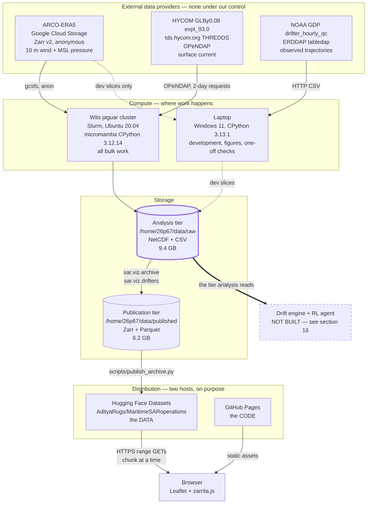
```mermaid
flowchart TB
    subgraph ext["External data providers — none under our control"]
        ARCO["ARCO-ERA5<br/>Google Cloud Storage<br/>Zarr v2, anonymous<br/>10 m wind + MSL pressure"]
        HYCOM["HYCOM GLBy0.08 expt_93.0<br/>tds.hycom.org THREDDS<br/>OPeNDAP<br/>surface current"]
        GDP["NOAA GDP drifter_hourly_qc<br/>ERDDAP tabledap<br/>observed trajectories"]
    end

    subgraph compute["Compute — where work happens"]
        LAPTOP["Laptop<br/>Windows 11, CPython 3.13.1<br/>development, figures, one-off checks"]
        CLUSTER["Wits jaguar cluster<br/>Slurm, Ubuntu 20.04<br/>micromamba CPython 3.12.14<br/>all bulk work"]
    end

    subgraph store["Storage"]
        RAW[("Analysis tier<br/>/home/26p67/data/raw<br/>NetCDF + CSV<br/>9.4 GB")]
        PUB[("Publication tier<br/>/home/26p67/data/published<br/>Zarr + Parquet<br/>6.2 GB")]
    end

    subgraph hosts["Distribution — two hosts, on purpose"]
        HF["Hugging Face Datasets<br/>AdityaRugs/MaritimeSARoperations<br/>the DATA"]
        PAGES["GitHub Pages<br/>the CODE"]
    end

    BROWSER["Browser<br/>Leaflet + zarrita.js"]
    ENGINE["Drift engine + RL agent<br/>NOT BUILT — see section 16"]

    ARCO -->|"gcsfs, anon"| CLUSTER
    HYCOM -->|"OPeNDAP, 2-day requests"| CLUSTER
    GDP -->|"HTTP CSV"| LAPTOP
    ARCO -.->|"dev slices only"| LAPTOP

    CLUSTER --> RAW
    LAPTOP -.->|"dev slices"| RAW
    RAW -->|"sar.viz.archive<br/>sar.viz.drifters"| PUB
    PUB -->|"scripts/publish_archive.py"| HF

    PAGES -->|"static assets"| BROWSER
    HF -->|"HTTPS range GETs<br/>chunk at a time"| BROWSER
    RAW ==>|"the tier analysis reads"| ENGINE

    style ENGINE stroke-dasharray: 5 5
    style RAW stroke-width:3px
```

### Why the two hosts are two hosts

**A hard project rule is that no data enters the git repository.** `*.nc`, `*.csv`, `*.parquet`
and `*.zarr/` are gitignored: one drifter pull is 108.8 MB, GitHub hard-rejects anything over
100 MB, and anything smaller that slips through stays in the history forever after deletion.

Splitting the site (GitHub Pages, code only) from the data (Hugging Face) satisfies that rule
**by construction rather than by discipline** — there is no path by which a data file could be
committed, because the deploy artefact is a Vite build of `frontend/` and the data is fetched
over HTTPS at runtime. Discipline fails; construction does not.

### The environments are not interchangeable, and that has bitten

| | Laptop | Cluster head node `jaguar1` | Cluster compute `jaguar11` |
|---|---|---|---|
| Python | 3.13.1 | 3.12.3 system | **3.12.14 micromamba** at `/home/26p67/envs/sar/bin/python` |
| Outbound 443 | yes | yes | **yes — measured, not assumed**, to GCS, `tds.hycom.org` and `huggingface.co` |
| gcsfs exit | **deadlocks** (§5.1) | clean | clean |
| Heavy work | fine | **forbidden** (§12.2) | this is what it is for |

---

## 3. Component architecture

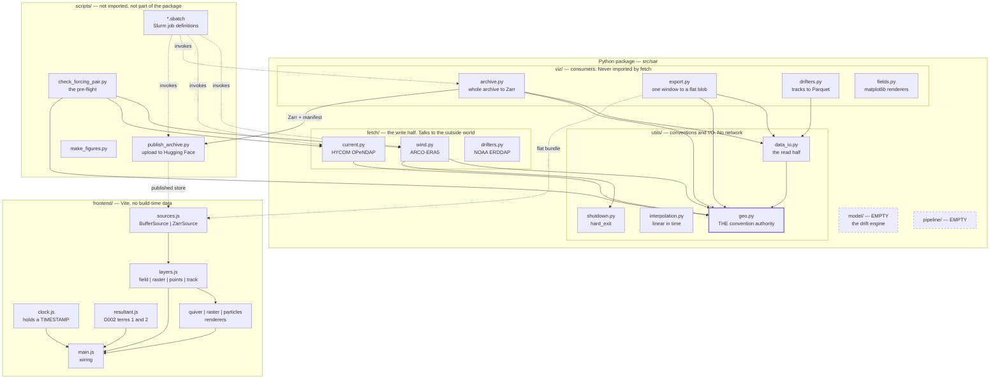
```mermaid
flowchart TB
    subgraph backend["Python package — src/sar"]
        direction TB

        subgraph fetchl["fetch/ — the write half. Talks to the outside world"]
            W["wind.py<br/>ARCO-ERA5"]
            C["current.py<br/>HYCOM OPeNDAP"]
            D["drifters.py<br/>NOAA ERDDAP"]
        end

        subgraph utilsl["utils/ — conventions and I/O. No network"]
            GEO["geo.py<br/>THE convention authority"]
            IO["data_io.py<br/>the read half"]
            INT["interpolation.py<br/>linear in time"]
            SD["shutdown.py<br/>hard_exit"]
        end

        subgraph vizl["viz/ — consumers. Never imported by fetch"]
            AR["archive.py<br/>whole archive to Zarr"]
            EX["export.py<br/>one window to a flat blob"]
            DR["drifters.py<br/>tracks to Parquet"]
            FL["fields.py<br/>matplotlib renderers"]
        end

        MODEL["model/ — EMPTY<br/>the drift engine"]
        PIPE["pipeline/ — EMPTY"]
    end

    subgraph scripts["scripts/ — not imported, not part of the package"]
        CFP["check_forcing_pair.py<br/>the pre-flight"]
        PA["publish_archive.py<br/>upload to Hugging Face"]
        MF["make_figures.py"]
        SB["*.sbatch<br/>Slurm job definitions"]
    end

    subgraph fe["frontend/ — Vite, no build-time data"]
        SRC["sources.js<br/>BufferSource | ZarrSource"]
        LAY["layers.js<br/>field | raster | points | track"]
        CLK["clock.js<br/>holds a TIMESTAMP"]
        RES["resultant.js<br/>D002 terms 1 and 2"]
        REN["quiver | raster | particles<br/>renderers"]
        MAIN["main.js<br/>wiring"]
    end

    W --> GEO
    C --> GEO
    W --> SD
    IO --> GEO
    AR --> IO
    AR --> GEO
    EX --> IO
    EX --> GEO
    DR --> IO
    CFP --> W
    CFP --> C
    CFP --> GEO
    SB -.->|"invokes"| W
    SB -.->|"invokes"| C
    SB -.->|"invokes"| AR
    SB -.->|"invokes"| PA
    AR -->|"Zarr + manifest"| PA

    PA -.->|"published store"| SRC
    EX -.->|"flat bundle"| SRC
    SRC --> LAY
    LAY --> REN
    CLK --> MAIN
    LAY --> MAIN
    RES --> MAIN
    REN --> MAIN

    style MODEL stroke-dasharray: 5 5
    style PIPE stroke-dasharray: 5 5
    style GEO stroke-width:3px
```

### Three structural rules, each of which has already paid for itself

**1. `geo.py` is the only place a coordinate convention is decided.** Every writer calls
`normalise_grid()` before writing and `assert_conventions()` after; every reader calls both on
the way in. See §6 for why.

**2. `fetch/` never imports `viz/`, and the engine will import neither.** `viz/` is a
*consumer*. The architecture decision for the engine forbids it importing a plotting library at
all, so matplotlib is imported *inside* the functions of `viz/fields.py` rather than at module
scope — a module that is cheap to import is a module that can be imported from anywhere.

**3. Frontend modules that import nothing are separate files.** `geo.js`, `drift.js`,
`style.js`, `beaufort.js`, `colormap.js` and `clock.js` have no dependency on Leaflet or on a
DOM, which is the entire reason **119 frontend tests** run in Vitest with no browser and no
jsdom. That split is the answer to "why are there so many small files": it is not decomposition
for its own sake, it is the test boundary. The counterexample is in the same tree —
`main.js` at 589 lines is the module that does the wiring, it needs a DOM, and it is
consequently the least-tested file in the frontend.

---

## 4. End-to-end data flow

One diagram for the whole system. Every arrow is a real code path; nothing here is planned.

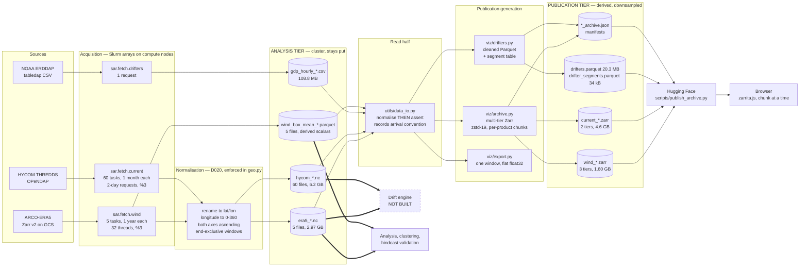
```mermaid
flowchart LR
    subgraph src["Sources"]
        A1["ARCO-ERA5<br/>Zarr v2 on GCS"]
        A2["HYCOM THREDDS<br/>OPeNDAP"]
        A3["NOAA ERDDAP<br/>tabledap CSV"]
    end

    subgraph acq["Acquisition — Slurm arrays on compute nodes"]
        B1["sar.fetch.wind<br/>5 tasks, 1 year each<br/>32 threads, %3"]
        B2["sar.fetch.current<br/>60 tasks, 1 month each<br/>2-day requests, %3"]
        B3["sar.fetch.drifters<br/>1 request"]
    end

    subgraph norm["Normalisation — D020, enforced in geo.py"]
        N["rename to lat/lon<br/>longitude to 0-360<br/>both axes ascending<br/>end-exclusive windows"]
    end

    subgraph raw["ANALYSIS TIER — cluster, stays put"]
        R1[("era5_*.nc<br/>5 files, 2.97 GB")]
        R2[("hycom_*.nc<br/>60 files, 6.2 GB")]
        R3[("gdp_hourly_*.csv<br/>108.8 MB")]
        R4[("wind_box_mean_*.parquet<br/>5 files, derived scalars")]
    end

    subgraph read["Read half"]
        RD["utils/data_io.py<br/>normalise THEN assert<br/>records arrival convention"]
    end

    subgraph pubgen["Publication generation"]
        P1["viz/archive.py<br/>multi-tier Zarr<br/>zstd-19, per-product chunks"]
        P2["viz/drifters.py<br/>cleaned Parquet<br/>+ segment table"]
        P3["viz/export.py<br/>one window, flat float32"]
    end

    subgraph pub["PUBLICATION TIER — derived, downsampled"]
        Q1[("wind_*.zarr<br/>3 tiers, 1.60 GB")]
        Q2[("current_*.zarr<br/>2 tiers, 4.6 GB")]
        Q3[("drifters.parquet 20.3 MB<br/>drifter_segments.parquet 34 kB")]
        Q4[("*_archive.json<br/>manifests")]
    end

    HFD["Hugging Face<br/>scripts/publish_archive.py"]
    BR["Browser<br/>zarrita.js, chunk at a time"]
    ENG["Drift engine<br/>NOT BUILT"]
    ANA["Analysis, clustering,<br/>hindcast validation"]

    A1 --> B1 --> N
    A2 --> B2 --> N
    A3 --> B3
    N --> R1
    N --> R2
    B1 --> R4
    B3 --> R3

    R1 --> RD
    R2 --> RD
    R3 --> RD
    R4 --> RD

    RD --> P1 --> Q1
    P1 --> Q2
    RD --> P2 --> Q3
    RD --> P3
    P1 --> Q4
    P2 --> Q4

    Q1 --> HFD
    Q2 --> HFD
    Q3 --> HFD
    Q4 --> HFD
    HFD --> BR

    R1 ==> ENG
    R2 ==> ENG
    R1 ==> ANA
    R4 ==> ANA

    style ENG stroke-dasharray: 5 5
```

**The heavy arrows matter.** Analysis and the engine read the **analysis tier** directly. They
never read the published copy. §7 is entirely about why that separation is enforced rather than
merely suggested.

---

## 5. Ingestion

Three sources, and **the interesting thing about them is that their failure models have nothing
in common.** ERA5 fails on *task-graph size and process exit*; HYCOM fails on *request size*;
ERDDAP fails on *schema*. A generic "fetcher" abstraction over all three would have hidden
exactly the property of each that had to be engineered against, which is why there are three
modules and not one.

| | ERA5 / ARCO | HYCOM / OPeNDAP | GDP / ERDDAP |
|---|---|---|---|
| Protocol | Zarr v2 over `gcsfs`, anonymous | OPeNDAP via xarray | HTTP CSV, tabledap |
| Native grid | 0.25°, **77 × 77** over the box | **476 lat × 238 lon** — 0.04° lat, 0.08° lon | irregular points |
| Native cadence | hourly | **3-hourly** | hourly |
| Per timestep | **46.3 KB** float32 | **885 KB** float32 in memory, **443 KB** on disk | — |
| Ratio | 1× | **19× wind** | — |
| Binding limit | **per-chunk latency** | **maximum answerable request** | none hit |
| Concurrency | 32 threads | serial, 2-day pieces | one request |
| Failure mode | silent hang, then deadlock at exit | 500 SocketTimeout after 36 min | wrong dtypes, fill values |

### 5.1 ERA5 via ARCO — a latency problem wearing a bandwidth problem's clothes

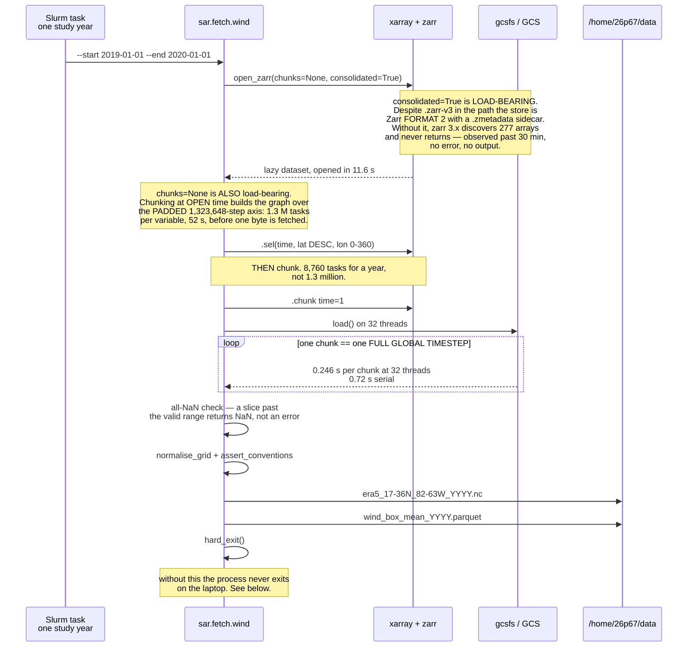
```mermaid
sequenceDiagram
    participant S as Slurm task<br/>one study year
    participant W as sar.fetch.wind
    participant Z as xarray + zarr
    participant G as gcsfs / GCS
    participant F as /home/26p67/data

    S->>W: --start 2019-01-01 --end 2020-01-01
    W->>Z: open_zarr(chunks=None, consolidated=True)
    Note over Z,G: consolidated=True is LOAD-BEARING.<br/>Despite .zarr-v3 in the path the store is<br/>Zarr FORMAT 2 with a .zmetadata sidecar.<br/>Without it, zarr 3.x discovers 277 arrays<br/>and never returns — observed past 30 min,<br/>no error, no output.
    Z-->>W: lazy dataset, opened in 11.6 s
    Note over W: chunks=None is ALSO load-bearing.<br/>Chunking at OPEN time builds the graph over<br/>the PADDED 1,323,648-step axis: 1.3 M tasks<br/>per variable, 52 s, before one byte is fetched.
    W->>Z: .sel(time, lat DESC, lon 0-360)
    Note over W,Z: THEN chunk. 8,760 tasks for a year,<br/>not 1.3 million.
    W->>Z: .chunk time=1
    W->>G: load() on 32 threads
    loop one chunk == one FULL GLOBAL TIMESTEP
        G-->>W: 0.246 s per chunk at 32 threads<br/>0.72 s serial
    end
    W->>W: all-NaN check — a slice past<br/>the valid range returns NaN, not an error
    W->>W: normalise_grid + assert_conventions
    W->>F: era5_17-36N_82-63W_YYYY.nc
    W->>F: wind_box_mean_YYYY.parquet
    W->>W: hard_exit()
    Note over W: without this the process never exits<br/>on the laptop. See below.
```

**Why 32 threads and not a bigger request.** The ARCO store is chunked `[1, 721, 1440]` — **one
chunk is a full global timestep**. Subsetting a 77 × 77 box therefore does *not* reduce what
crosses the wire; the cost is pure per-chunk latency. **Measured: 0.72 s/chunk serial → 26 h for
five years; 0.246 s/chunk at 32 threads → 9 h.** Concurrency is the entire fix, and it is the
reason `THREADS` is an environment variable rather than a constant: 32 is right for a dedicated
node and antisocial on a shared one (§12.2).

**Why select-then-chunk, and why the cost hid for six days.** The table below is the whole of it:

| | open time | task graph |
|---|---|---|
| `chunks={"time": 1}` at open | **52.0 s** | **1,323,649 tasks** for one variable |
| `chunks=None`, then select, then chunk | **11.6 s** | **3 tasks** |

The cost is **fixed, not proportional to the window**, which is exactly why it was invisible: it
was paid identically by the one-week verification run on 2026-09-10 and charged to "the
download". On 2026-09-15 it burned six cores for 30 minutes on the head node at **zero bytes per
second of network** before anyone thought to look at a counter.

Chunking *coarser* than one timestep shrinks the graph further and is also wrong — each task
would then read its 24 global timesteps in series, and the pull is latency-bound, so collapsing
concurrency is the one thing that cannot be afforded. Select first, then chunk at `time=1`, gets
a graph the size of the window at full 32-way concurrency.

**The padded-axis trap.** ARCO's time axis runs **1900-01-01 → 2050-12-31, 1,323,648 steps**,
but valid data stops at **2026-05-31** (final) / **2026-09-04** (preliminary ERA5T, which gets
revised). A slice past the valid range returns **all-NaN rather than raising**. `fetch_wind_box`
therefore asserts on all-NaN explicitly, and the CLI prints the padded axis and both valid
ranges every run, so the number that goes in the notebook is the one the store reported today.

**The `hard_exit()` deadlock — and the wrong conclusion it nearly caused.** Measured
2026-09-17, both machines:

| | laptop, Win 11, CPython 3.13.1 | cluster, CPython 3.12.14 |
|---|---|---|
| open the store | 14.0 s | 15.2 s |
| fall off the end of `main()` | **killed at 180 s on 0.03 s of user CPU** | **15.5 s wall, exit 0** |

Not slow — deadlocked. Every thread alive at exit is a daemon (`zarr_io`, `asyncio_0`,
`_poll_wrapper`) and daemon threads do not block shutdown, so it is not that. It is an `atexit`
handler: `concurrent.futures.thread._python_exit` joins pooled worker threads *regardless* of
their daemon flag, and one never returns. **`ds.close()` does not fix it** — still killed at
90 s. Skipping interpreter shutdown does: **14.1 s, exit 0**.

The negative result is the more valuable half and is written into
`src/sar/utils/shutdown.py`'s docstring for that reason: **the cluster does not have this bug,
so it does not explain the eight-hour wall-clock kills that job array 58632 took.** That
connection was tempting and wrong. `hard_exit()` is called only as the last statement of a CLI
`main()`, never in library code, and never before output is on disk — it runs no `atexit`
handlers and no destructors.

`hard_exit` is also deliberately unconditional rather than `if sys.platform == "win32"`.
A branch that only ever runs on one of two machines is a branch only ever tested on one of them.

### 5.2 HYCOM via OPeNDAP — rate and maximum request size are independent limits

This is the most instructive failure in the project, and **L15** in the limitations register.

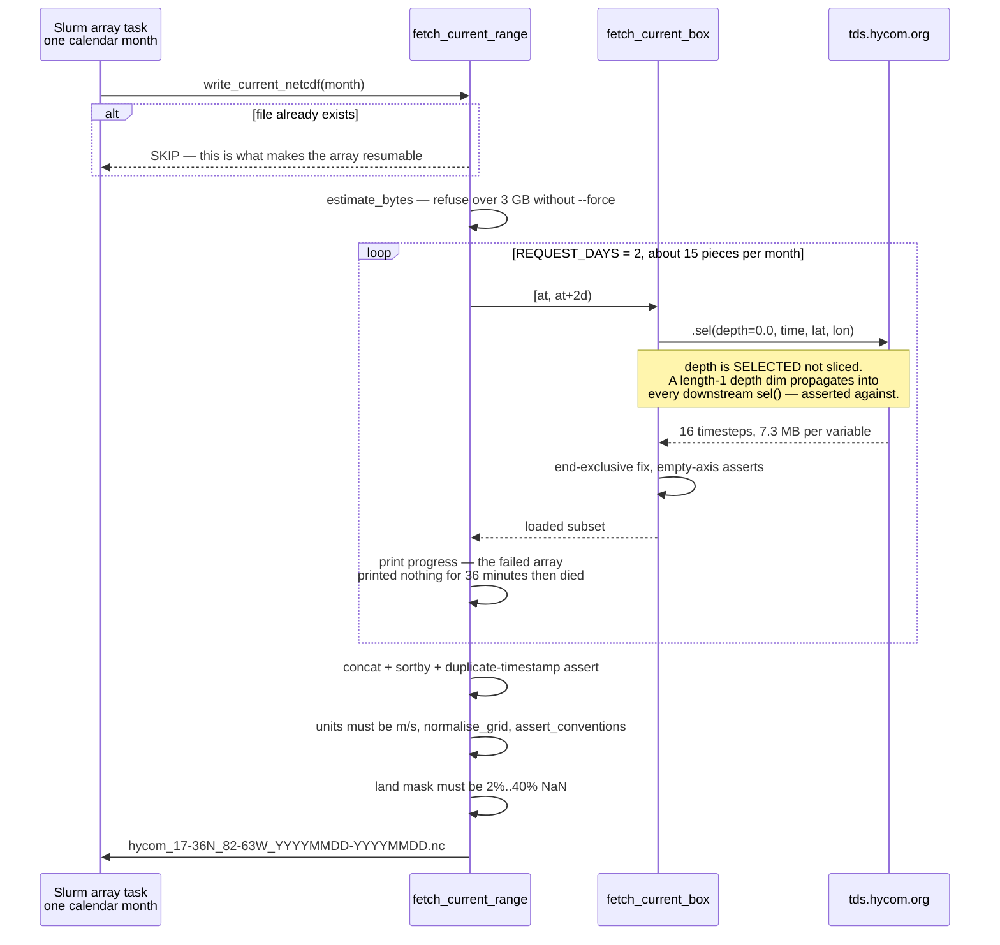
```mermaid
sequenceDiagram
    participant A as Slurm array task<br/>one calendar month
    participant C as fetch_current_range
    participant B as fetch_current_box
    participant T as tds.hycom.org

    A->>C: write_current_netcdf(month)
    alt file already exists
        C-->>A: SKIP — this is what makes the array resumable
    end
    C->>C: estimate_bytes — refuse over 3 GB without --force
    loop REQUEST_DAYS = 2, about 15 pieces per month
        C->>B: [at, at+2d)
        B->>T: .sel(depth=0.0, time, lat, lon)
        Note over B,T: depth is SELECTED not sliced.<br/>A length-1 depth dim propagates into<br/>every downstream sel() — asserted against.
        T-->>B: 16 timesteps, 7.3 MB per variable
        B->>B: end-exclusive fix, empty-axis asserts
        B-->>C: loaded subset
        C->>C: print progress — the failed array<br/>printed nothing for 36 minutes then died
    end
    C->>C: concat + sortby + duplicate-timestamp assert
    C->>C: units must be m/s, normalise_grid, assert_conventions
    C->>C: land mask must be 2%..40% NaN
    C->>A: hycom_17-36N_82-63W_YYYYMMDD-YYYYMMDD.nc
```

**The measurement that was correct and useless.** Before the bulk pull, throughput was measured
against the live server: **4.0 s per timestep** over a 4-day request. That number is right. It
is also completely silent about the thing that actually broke:

| Request | Timesteps | MB/var | Result |
|---|---|---|---|
| half-year | 1,448 | ~650 | **500 SocketTimeoutException after ~36 min, nothing written.** Six array tasks died this way |
| 8 days | 64 | 29 | **also timed out**, on `water_v` |
| 4 days | 32 | 14.5 | went through in **128 s** |
| **2 days** | **16** | **7.3** | **chosen** — half the largest size observed to work |

```
500  java.net.SocketTimeoutException: Read timed out;
     water_u -- 8981:10428,0:0,2425:2900,3475:3712
```

**A rate and a maximum answerable request are independent limits, and only the rate had been
measured.** A subsequent scan of **1,600 individual days found zero unreadable** — which is what
proves the archive itself is complete and the fault was entirely in how it was being asked for.

The 2-day margin is deliberate, not timid: throughput from this endpoint varies by almost an
order of magnitude between runs (**4.0 s/timestep clean, 35 s on the first 3-day pull**), so a
size that only just works on a good day will not survive a bad one. xarray does retry, but each
retry costs a full server timeout and the task runs out of wall clock instead of failing
cleanly — which is worse than a clean failure, because it looks like a hang.

**Hence months, and hence resume.** The job array is **60 tasks, one calendar month each, `%3`
concurrent**:

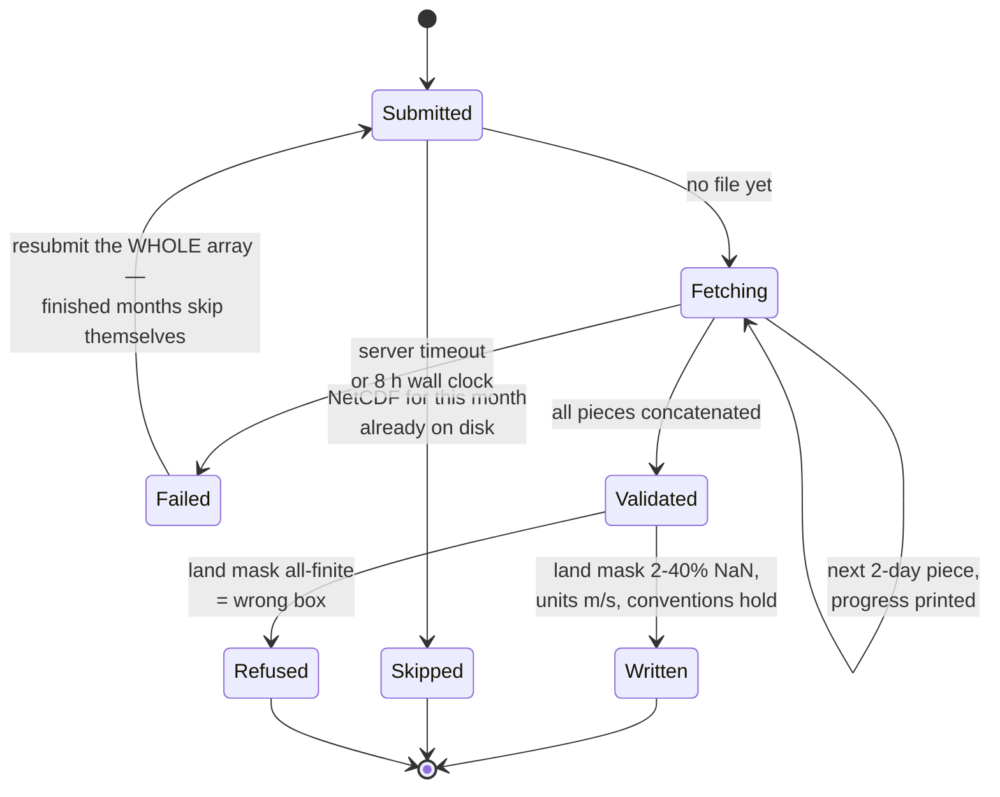
```mermaid
stateDiagram-v2
    [*] --> Submitted
    Submitted --> Skipped: NetCDF for this month<br/>already on disk
    Submitted --> Fetching: no file yet
    Fetching --> Fetching: next 2-day piece,<br/>progress printed
    Fetching --> Failed: server timeout<br/>or 8 h wall clock
    Fetching --> Validated: all pieces concatenated
    Validated --> Written: land mask 2-40% NaN,<br/>units m/s, conventions hold
    Validated --> Refused: land mask all-finite<br/>= wrong box
    Written --> [*]
    Skipped --> [*]
    Failed --> Submitted: resubmit the WHOLE array —<br/>finished months skip themselves
    Refused --> [*]
```

A lost task costs one month, not six, and the array can simply be resubmitted until the archive
is complete. **Against a server this erratic, resumability matters more than picking the right
size.** Result: 60/60 months, **6.2 GB**, zero failures on the run that landed.

**`%3` is a politeness cap, not a performance tune.** `tds.hycom.org` is a public server run for
everyone, not an allocation we hold.

**The land-mask assertion is the cheapest proof the pull is real.** 2 %–40 % of box cells must
be NaN. All-finite means the box missed the coast entirely — almost always a longitude
convention error — and mostly-NaN means the depth level or the window is wrong. Both of those
otherwise produce a file that opens, plots, and is wrong.

**`drop_variables=["tau"]` on open** is load-bearing for an unrelated reason: `tau`'s units are
`"hours since analysis"`, which is not a parseable reference date, and xarray's CF time decoder
chokes on it before `water_u` is ever reached.

**The int16 discovery, which halved a budget.** HYCOM serves `water_u`/`water_v` packed as
**int16 with `scale_factor = 0.001`**. xarray decodes to float32 on read and **re-applies that
encoding on write**, so the archive is int16 on disk at 1 mm/s resolution — far finer than the
data is accurate to, so nothing is lost. Measured on a real month: **112 MB for 247 timesteps =
443 KB/timestep, exactly half the in-memory figure.** The five-year archive is therefore
**~6.2 GB on disk, not the 12.9 GB** quoted in the earlier decision records. The in-memory
figure is still the right one for sizing a job's `--mem`, and the size guard deliberately still
uses it, because what it bounds is memory during the pull.

### 5.3 GDP drifters via ERDDAP — a schema problem

One request, no concurrency, no size limit hit. The engineering is entirely in **not trusting
what comes back**.

| Trap | What it does if unhandled | Handling |
|---|---|---|
| ERDDAP writes a **units row** directly under the header | every numeric column loads as `object` dtype | `skiprows=[1]` on fetch; `data_io.load_drifters` **detects** it, because the 108.8 MB CSV already on disk still carries it |
| `sst` arrives in **Kelvin** with unmasked fill values — observed raw range **−76.9 to 1000 °C** | ~99.9 % of values are plausible, so a naive mean looks *almost* right | convert to Celsius, mask to `[−2, 40]` |
| `drogue_lost_date` is **per buoy** | treating "undrogued" as a buoy property mislabels every observation before the drogue was lost | `undrogued` computed **per observation**: `drogue_lost_date.notna() & (time >= drogue_lost_date)` |
| Longitude arrives −180…180 | disagrees with both forcing archives | converted to 0–360 on load |
| The hourly QC product **ends 2022-10-31** | a request for 2024 succeeds and returns less than asked | measured and recorded; it is one of the three dates that set the study window |

**Why undrogued observations are the point.** A drogued GDP buoy hangs a drogue at 15 m
specifically to follow water and ignore wind, so α ≈ 0 and it **cannot validate the leeway term
at all**. When the drogue snaps off, the buoy floats at the surface and does feel wind —
downwind slip ~1 % of wind speed (Pazan & Niiler 2001; Poulain et al. 2009), revised ~50 %
higher by Lumpkin et al. 2013, so ~1–1.5 %. A person in water is 1.9–2.7 %. **An undrogued buoy
is therefore a lower bound on human leeway** — weaker than a person, but not zero — which is
exactly what makes a paired α-on/α-off validation test possible.

Measured 2026-09-10 and reproduced independently by `data_io.py` on 2026-09-16:
**926,533 observations, 268 buoys, 77.9 % undrogued, 825 contiguous in-box segments** (a gap
> 3 h starts a new segment), of which **640 last at least 48 h**.

> **A correction lives here, and it is the kind this document exists to preserve.** An earlier
> decision record cited **642** segments ≥ 48 h. That figure counts *observations*, and 48
> hourly observations span **47 hours**. Two segments sit in that gap and cannot verify a 48 h
> forecast. For the stated purpose the number is **640**, and the manifest key is named
> `segments_over_48h_duration` so the criterion travels with the number.

---

## 6. The convention layer

### 6.1 The bug that created it

On 2026-09-15 the wind fetcher wrote longitude **−70.0** and the current fetcher wrote **290.0**
for the same Gulf Stream cell, and they named their axes differently on top of that
(`latitude`/`longitude` versus `lat`/`lon`).

**Neither script was wrong on its own, and both passed their own checks.** That is precisely why
it survived, and it was found by comparing two *working* scripts rather than by either failing.

### 6.2 The rule

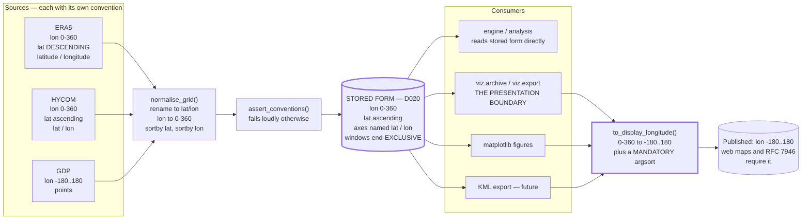
```mermaid
flowchart LR
    subgraph sources["Sources — each with its own convention"]
        S1["ERA5<br/>lon 0-360<br/>lat DESCENDING<br/>latitude / longitude"]
        S2["HYCOM<br/>lon 0-360<br/>lat ascending<br/>lat / lon"]
        S3["GDP<br/>lon -180..180<br/>points"]
    end

    NG["normalise_grid()<br/>rename to lat/lon<br/>lon to 0-360<br/>sortby lat, sortby lon"]
    AC["assert_conventions()<br/>fails loudly otherwise"]

    STORE[("STORED FORM — D020<br/>lon 0-360<br/>lat ascending<br/>axes named lat / lon<br/>windows end-EXCLUSIVE")]

    subgraph consumers["Consumers"]
        E["engine / analysis<br/>reads stored form directly"]
        V["viz.archive / viz.export<br/>THE PRESENTATION BOUNDARY"]
        K["KML export — future"]
        FIG["matplotlib figures"]
    end

    DISP["to_display_longitude()<br/>0-360 to -180..180<br/>plus a MANDATORY argsort"]
    OUT[("Published: lon -180..180<br/>web maps and RFC 7946<br/>require it")]

    S1 --> NG
    S2 --> NG
    S3 --> NG
    NG --> AC --> STORE
    STORE --> E
    STORE --> V --> DISP --> OUT
    STORE --> FIG --> DISP
    STORE --> K --> DISP

    style STORE stroke-width:3px
    style DISP stroke-width:3px
```

**Store 0–360. Convert once, at the presentation boundary. Never anywhere else.**

**Why 0–360 and not the friendlier −180…180?** Both source stores serve 0–360. Storing it
unchanged means **the number on disk is the number the server gave us**, so any later
discrepancy is a real discrepancy rather than possibly our own arithmetic. *A conversion that
never happens cannot be got wrong.* The cost is that every human-facing output needs one
conversion, which is a known, single, tested location — `to_display_longitude()`, called in
exactly three places: `viz/archive.py`, `viz/export.py`, and `viz/fields.py::_display_axes`.

### 6.3 The three traps the rule defuses

**Trap 1 — latitude order.** ERA5 is served **descending** (90 → −90). `sel(lat=slice(17, 36))`
on a descending axis returns an **empty selection without raising**. `fetch_wind_box` slices
`slice(lat_n, lat_s)` deliberately and asserts the result is non-empty; `normalise_grid` then
sorts ascending so no downstream consumer has to know.

**Trap 2 — the end-exclusive off-by-one.** xarray reads a bare date string as **the whole day**,
so `slice(start, end)` includes all of `end` — 24 extra hours. Pulling year by year, that
duplicates **1 January at every boundary** and leaves the concatenated archive with repeated
timestamps. Both fetchers now apply `sub.sel(time=sub.time < np.datetime64(end))` explicitly.
The pre-flight check (§13.1) asserts the window sizes: a one-day window must be **24** hourly
wind steps and **8** three-hourly current steps, and until 2026-09-15 both returned 48 and 16.

**Trap 3 — point lookups against the wrong convention.** Nearest-neighbour selection of `-70`
against an 0–360 axis silently returns the **0° meridian** rather than raising. `fetch_wind`
converts *before* selecting.

### 6.4 Normalise before you assert — the read half

The archive is **genuinely mixed**. Files written before 2026-09-15 are pre-D020; the cluster
archive written after is compliant. A loader that only calls `assert_conventions()` rejects
every local development file in existence.

So `data_io.open_forcing` does three things in this order:

1. **Judge** the arrival convention before touching anything — a file is pre-D020 if it fails on
   *any* of axis names, latitude order or longitude range.
2. **Normalise**, then assert.
3. **Record** the verdict in `ds.attrs["sar_arrival_convention"]` and, for a stale file, **warn
   once, loudly, naming the file**.

Repairing silently would have been worse than the bug: a stale file would be fixed on every read
and nobody would ever learn it was stale. The manifest written by `viz/export.py` carries
`arrival_convention` through to the browser for the same reason.

---

## 7. Storage architecture

### 7.1 Two tiers, and they do not compete

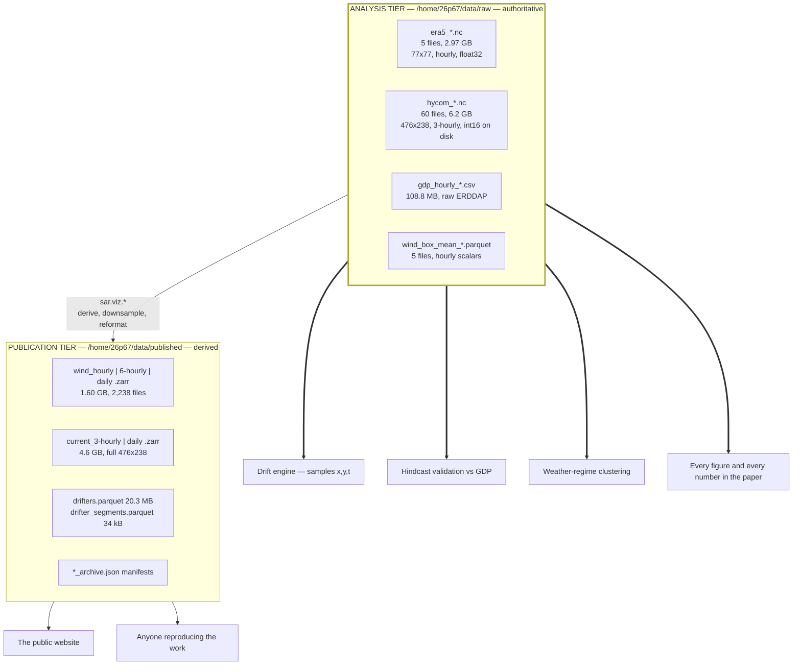
```mermaid
flowchart TB
    subgraph T1["ANALYSIS TIER — /home/26p67/data/raw — authoritative"]
        direction LR
        A1["era5_*.nc<br/>5 files, 2.97 GB<br/>77x77, hourly, float32"]
        A2["hycom_*.nc<br/>60 files, 6.2 GB<br/>476x238, 3-hourly, int16 on disk"]
        A3["gdp_hourly_*.csv<br/>108.8 MB, raw ERDDAP"]
        A4["wind_box_mean_*.parquet<br/>5 files, hourly scalars"]
    end

    subgraph T2["PUBLICATION TIER — /home/26p67/data/published — derived"]
        direction LR
        B1["wind_hourly | 6-hourly | daily .zarr<br/>1.60 GB, 2,238 files"]
        B2["current_3-hourly | daily .zarr<br/>4.6 GB, full 476x238"]
        B3["drifters.parquet 20.3 MB<br/>drifter_segments.parquet 34 kB"]
        B4["*_archive.json manifests"]
    end

    C1["Drift engine — samples x,y,t"]
    C2["Hindcast validation vs GDP"]
    C3["Weather-regime clustering"]
    C4["Every figure and every number in the paper"]
    D1["The public website"]
    D2["Anyone reproducing the work"]

    T1 ==> C1
    T1 ==> C2
    T1 ==> C3
    T1 ==> C4
    T1 -->|"sar.viz.*<br/>derive, downsample, reformat"| T2
    T2 --> D1
    T2 --> D2

    style T1 stroke-width:3px
```

**Nothing in the publication path moves or replaces the archive.** The published copy is
derived, downsampled and reformatted for a browser; the NetCDF remains what analysis reads.
Confusing the two is how a "derived" file quietly becomes the source of truth, and the direction
of that mistake is always the same — the derived copy is smaller, easier to open and already
in the shape the last figure needed.

### 7.2 Why the analysis tier is NetCDF and not flat text

`scripts/fetch_current_range.py` writes long-format text — one row per `(time, lat, lon)` —
which is the natural output of a "get me the data" script and is the wrong archive format by two
orders of magnitude:

| Two days of the full box | Size |
|---|---|
| long-format text / CSV | **~160 MB** |
| gridded NetCDF | **~11–14 MB** |

The five-year archive would be **hundreds of GB** as text, which does not merely cost disk — it
puts the archive beyond the reach of every tool that would read it. Long format survives as the
*analytics* export, where a row-oriented shape is what a dataframe wants, and the gridded
NetCDF is the archive. **Same data, two shapes, two jobs.**

### 7.3 Why the publication tier exists at all, and is not just "the NetCDF over HTTP"

**NetCDF is one self-describing file you open with a library.** To read a single cell out of a
600 MB file, a browser must fetch the 600 MB. There is no partial-read story for NetCDF that
works in a browser without a server in front of it — and §10 explains why there is no server.

**Zarr is the same array split into many small files.** Fetching "January 2021 over the box" is
a handful of ordinary HTTP GETs for exactly the chunk files that cover it. No server, no index
service, no library on the host side; **the browser becomes the query engine.** ERA5's own
upstream source is a Zarr store and `zarr==3.3.0` was already pinned, so this runs with the
grain of the project rather than being bolted onto it.

### 7.4 Why nothing lives in the git repository

| Candidate | Verdict |
|---|---|
| Commit the data | **Refused.** 108.8 MB for one drifter pull; GitHub hard-rejects >100 MB and anything smaller that slips through **stays in history after deletion**. Regenerated exports would accumulate forever |
| Amazon S3 | per-GB egress — a site that gets used costs money |
| **Cloudflare R2** | **Rejected 2026-09-17.** See §10.1 |
| **Hugging Face Datasets** | **Chosen.** See §10.1 |

`.gitignore` covers `*.nc`, `*.csv`, `*.parquet` and `*.zarr/` — but **not `*.json` or
`*.geojson`**, so an exported bundle manifest would have been committed by accident.
`frontend/public/data/` was added to close that.

---

## 8. The Zarr publication path

`src/sar/viz/archive.py`. Four decisions, all measured.

### 8.1 The pipeline

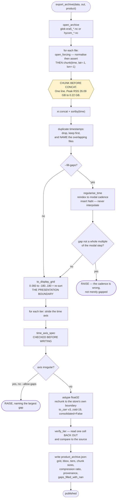
```mermaid
flowchart TB
    START(["export_archive(data, out, product)"]) --> OPEN

    OPEN["open_archive<br/>glob era5_*.nc or hycom_*.nc"]
    OPEN --> PERFILE

    PERFILE["for each file:<br/>open_forcing — normalise then assert<br/>THEN chunk(time, lat=-1, lon=-1)"]
    PERFILE --> CHUNKNOTE

    CHUNKNOTE{{"CHUNK BEFORE CONCAT.<br/>One line. Peak RSS 26.09 GB to 0.22 GB."}}
    CHUNKNOTE --> CONCAT

    CONCAT["xr.concat + sortby(time)"]
    CONCAT --> DUP

    DUP["duplicate timestamps:<br/>drop, keep first,<br/>and NAME the overlapping files"]
    DUP --> GAPS

    GAPS{"--fill-gaps?"}
    GAPS -->|yes| REG["regularise_time<br/>reindex to modal cadence<br/>insert NaN — never interpolate"]
    GAPS -->|no| DISP
    REG --> RAGGED{"gap not a whole multiple<br/>of the modal step?"}
    RAGGED -->|yes| RAISE1(["RAISE — the cadence is wrong,<br/>not merely gapped"])
    RAGGED -->|no| DISP

    DISP["to_display_grid<br/>0-360 to -180..180 + re-sort<br/>THE PRESENTATION BOUNDARY"]
    DISP --> TIERLOOP

    TIERLOOP["for each tier: stride the time axis"]
    TIERLOOP --> AXIS

    AXIS["time_axis_spec<br/>CHECKED BEFORE WRITING"]
    AXIS --> IRREG{"axis irregular?"}
    IRREG -->|"yes, no --allow-gaps"| RAISE2(["RAISE, naming the largest gap"])
    IRREG -->|no| WRITE

    WRITE["astype float32<br/>rechunk to the store's own boundary<br/>to_zarr v3, zstd-19, consolidated=False"]
    WRITE --> VERIFY

    VERIFY["verify_tier — read one cell BACK OUT<br/>and compare to the source"]
    VERIFY --> MAN

    MAN["write product_archive.json:<br/>grid, bbox, tiers, chunk sizes,<br/>compression ratio, provenance,<br/>gaps_filled_with_nan"]
    MAN --> DONE(["published"])

    style CHUNKNOTE fill:#fff3cd,stroke:#856404
    style RAISE1 stroke-width:2px
    style RAISE2 stroke-width:2px
```

### 8.2 Chunk before concat — the one line that decides whether it runs

The current export was **SIGKILLed twice** against a 24 GB Slurm limit. Two attempts went on
plausible stories about the sort, the `astype` and the write. A ten-line probe printing peak RSS
per stage answered it in one run:

```
after 60 x open_forcing     0.22 GB
after xr.concat            26.09 GB   <- here
after chunk                26.09 GB   <- the "fix", applied too late
```

`xr.concat` on lazily-indexed numpy backends **materialises everything it is given**. Chunking
afterwards cannot help, because the memory is already gone. With dask in place *first*, the
concat is a graph and peak memory is a few chunks: **26.09 GB → 0.22 GB.**

The bug had existed since the exporter was written. Wind never found it — its whole hourly tier
is about 1 GB. **Only the current archive, at 19× per timestep, was large enough to expose it**,
which is a general property worth stating: a pipeline validated only on its small input has not
been validated.

### 8.3 Compression — measured on real data, and the winner is not the textbook answer

On **9.11 MB of real float32 wind**, 2026-09-17:

| Codec | Size | Ratio | Write speed | |
|---|---|---|---|---|
| none | 9.11 MB | 1.00× | — | |
| zstd-3 | 7.20 MB | 1.26× | 161 MB/s | |
| zstd-9 | 6.58 MB | 1.39× | 106 MB/s | |
| **zstd-19** | **5.78 MB** | **1.58×** | 20 MB/s | **chosen** |
| blosc + zstd + shuffle | 7.11 MB | 1.28× | — | **rejected** |

**Blosc with a byte shuffle is the standard recommendation for float arrays, and it is rejected
for a reason that has nothing to do with its ratio: `zarrita.js` cannot decode it.** Plain zstd
is a registered codec in the Zarr v3 core spec and can be read in a browser. **A compression
ratio the client cannot read is 1.00×.** This is the clearest example in the system of a
*deployment* constraint overruling a *technical* one, and it was only caught because the client
was verified against the real store rather than assumed (§13.3).

zstd-19 is affordable precisely because the asymmetry runs the right way: it costs **1.7 minutes
of CPU** for the 2.03 GB hourly tier, **once**, and zstd decodes at roughly the same speed
whatever level wrote it — so the browser pays nothing for the extra ratio.

> **A correction worth carrying: the 1.7-minute figure was zstd throughput alone.** End to end
> the wind publish took **13 min 02 s**, because reading and sorting 3.1 GB of NetCDF dominates
> the compression. Compression was never the bottleneck it was budgeted as.

### 8.4 Chunking — per product, and the lever is length, not resolution

**One chunk is one HTTP GET, so the chunk size is really "how much does the browser download to
show one moment".**

| | grid | 48-step chunk | 8-step chunk |
|---|---|---|---|
| wind | 77 × 77 | **1.11 MB** — chosen | — |
| current | 476 × 238 | **29.0 MB** — unusable | **4.8 MB** — chosen |

48 steps is exactly the **48 h scenario window at hourly cadence** — the organising unit the
engine design already uses — so a scenario is one chunk rather than a straddle. For current at
3-hourly, 8 steps is a **24 h window**, which is also a natural scrub unit.

The box is chunked **whole in space** rather than tiled, because the box is small and every
renderer draws all of it at once, so a spatial tile would only ever be fetched together with its
neighbours.

> **This decision was made wrongly first, and the reversal is the point.**
>
> An earlier revision **halved the current grid** to bring the per-fetch size down, and a
> limitation (**L14**) was written into the report register to declare it. That was the wrong
> lever. Storage was never the binding constraint — **bytes per fetch** was — and chunk length
> controls bytes per fetch without discarding anything. Halving the grid throws away **three
> quarters of the cells** to solve a problem chunking solves for free, and it would have landed
> the published site at 7.3 MB per fetch anyway, worse than the 4.8 MB the full grid achieves
> with shorter chunks.
>
> **L14 is retired.** A limitation that turns out to be avoidable should be removed rather than
> carried.
>
> The process failure underneath it is worth more than the technical one. The half-resolution
> plan was found in the decision record and implemented **because it was written there** — a
> running publish job was cancelled 33 minutes in to comply with it — before anyone re-derived
> whether it was still right. **A decision record is evidence, not an instruction.** It states
> what was known on the day it was written.

### 8.5 Tiers are strided, not averaged

| Product | Tiers | Stride in source timesteps |
|---|---|---|
| wind (hourly source) | hourly / 6-hourly / daily | 1 / 6 / 24 |
| current (3-hourly source) | 3-hourly / daily | 1 / 8 |

The tier carries the **stride**, not a cadence, because the same stride means different things
for each product.

**A 24 h mean of a rotating wind vector is close to zero.** An averaged daily tier would show
five years of calm. A stride shows a real hour, just fewer of them. There is a test pinning
this, because it is the kind of thing a later "optimisation" would helpfully undo.

**Counter-intuitive measured result: coarser tiers compress *worse* per frame** — 29.5 → 36.1 →
39.7 KB. Striding throws away the temporal correlation zstd was exploiting. It does not matter
at these sizes, but it means **a tier's cost cannot be scaled from another tier's ratio**, which
is exactly what a size projection would naturally do.

### 8.6 The time-axis guard — because a gapped axis does not fail, it mislabels

The client reconstructs every frame's timestamp as `start + k × step`, exactly as it
reconstructs coordinates as `lat0 + j × dlat`. **That is only valid on a regular axis.**

Measured on the real local archive: eight days of January plus two days of March concatenate to
264 frames with one **1,225-hour** gap. Reconstructed from start and step, the last frame comes
out at **2021-01-11 instead of 2021-03-03 — 51 days wrong, on a map that renders perfectly.**

So:

- `write_zarr_tier` calls `time_axis_spec` **before writing anything**, and refuses an irregular
  axis, naming the largest gap. A gapped axis should cost nothing to discover, not a gigabyte of
  upload followed by a mislabelled map.
- `--allow-gaps` publishes anyway with `"regular": false`, and then the client **must** read the
  store's own `time` array.
- The client **refuses** a tier marked `regular: false` rather than reconstructing it (§11.2).
- `publish_archive.py` checks again at upload, because the two steps can run days apart and what
  reaches the browser is what matters.

`grid_spec` in `viz/export.py` applies the identical guard to the lat/lon axes. The time axis
simply did not have one until it was given one.

### 8.7 Real gaps are published as NaN

HYCOM genuinely is missing timesteps: **7 in 14,608 (0.048 %)** over the study window — four 6 h
gaps and one 12 h gap against a 3-hourly cadence. That figure was arrived at independently, from
a different code path, by the missing-timestep analysis, which is why it is trusted.

Three ways to publish that, and only one is honest:

| Option | Why not |
|---|---|
| Interpolate across them | **Invents current fields that were never modelled**, in a store whose entire purpose is to be the thing other results are checked against |
| Publish the squashed axis | Keeps every real value, but makes the client read a `time` array to know what it is looking at, and renders a 12 h jump as a 3 h step |
| **Insert NaN** | **Chosen.** `start + k × step` stays valid, the client stays simple, the absent hours are absent rather than interpolated, and **every renderer already treats NaN as "no data here" because the land mask taught them to** |

Only gaps that are exact multiples of the modal step can be filled this way. Anything else means
the *cadence* is wrong, which is not a hole to paper over — it raises. The manifest says
`gaps_filled_with_nan` out loud, so a reader of the published store knows some frames are NaN by
construction rather than by accident.

### 8.8 Round-trip verification

`verify_tier` reads a cell **back out of the written store** and compares it to the source, at
`time // 2`, `lat // 3`, `lon // 3`. The chunking and the 0–360 → −180…180 conversion are both
things that can be wrong **in a way that still renders** — a mirrored map, an off-by-one frame —
so the round trip is checked rather than assumed, and the result goes into the manifest.

All five published tiers verified, and all reported `regular` — which is independent
confirmation that the five-year archives are genuinely contiguous, since the axis guard would
have refused them otherwise.

### 8.9 As built

| Product | Tier | Frames | On disk | Ratio | Files | Chunk | Per fetch |
|---|---|---|---|---|---|---|---|
| wind | hourly | 43,824 | 1,273.7 MB | 1.63× | 1,836 | 48 × 77 × 77 | 1.11 MB |
| wind | 6-hourly | 7,304 | 257.5 MB | 1.34× | 315 | 48 × 77 × 77 | 1.11 MB |
| wind | daily | 1,826 | 71.8 MB | 1.21× | 87 | 48 × 77 × 77 | 1.11 MB |
| current | 3-hourly | 14,608 | ~4,100 MB | — | — | **8** × 476 × 238 | **4.8 MB** |
| current | daily | 1,826 | 524 MB | — | — | 8 × 476 × 238 | 4.8 MB |

Wind published in **13 min 02 s** (Slurm 58640); current in **49 min** (Slurm 58726). The
five-year wind archive compressed **better** than the 8-day sample the projection came from
(1.63× against 1.57×), so the estimate was 4 % high. The current archive came in at **4.6 GB
against 9.9 GB projected** from wind's ratio — a smoother field compresses better, which is the
same lesson as §8.5 in the other direction: **ratios do not transfer between datasets.**

---

## 9. The Parquet publication path

`src/sar/viz/drifters.py`. Short, but two of its decisions are load-bearing.

**Parquet, not Zarr.** Drifter records are irregular positions at irregular times, one row per
observation per buoy. That is **not a gridded array**, and forcing it into one throws away the
thing that makes a trajectory a trajectory. Parquet is also what Hugging Face's dataset viewer
renders, which makes the published data browsable without any code.

**The cleaned frame is published, not the raw CSV.** `load_drifters` applies every rule the
fetcher established — units row, longitude to 0–360, SST Kelvin → Celsius masked against fill
values, `undrogued` per observation, `segment_id` split on > 3 h gaps. **Republishing the raw
file would hand every reader the same four traps** (§5.3), and the person best placed to fix
them once is the person who already found them.

Two artefacts, because they answer different questions:

| File | Rows | Size | Purpose |
|---|---|---|---|
| `drifters.parquet` | 926,533 observations | **20.3 MB** from 108.8 MB of CSV | the data |
| `drifter_segments.parquet` | **825 segments** | 34 kB | "how many independent validation cases do we have" — and it lets the site draw tracks **without scanning a million rows** |

One more guard worth copying: choosing the source file is **explicit**. `files[-1]` silently
picked the *smallest* of three local CSVs, so the script now refuses and lists them rather than
guessing.

---

## 10. Distribution

### 10.1 Host selection — the deciding factor was a billing policy, not a technical limit

| Host | Verdict |
|---|---|
| **GitHub Pages** | **Chosen, for the site.** Free, versioned with the code, publishes on push. Comfortable to ~1 GB — enough for code, not for the archive |
| ~~**Cloudflare R2**~~ | **Rejected 2026-09-17.** The free tier is real — 10 GB-month, 1 M Class A, 10 M Class B operations, **zero egress** — and our operation count is nowhere near the limits. It was rejected because **a payment card must be linked**, and Cloudflare's billing policy places **preauthorisation holds** on that card for usage-based services; **if a hold fails, buckets return errors and the data is deleted after 30 days.** A site that must stay up through assessment should not carry a billing failure mode |
| **Hugging Face Datasets** | **Chosen, for the data.** No card. Serves over CloudFront. Limits are <100k files per repo and <10k per folder against our few thousand chunks. Built for public research data, so citing it in the paper needs no explanation. Requires a dataset card, which the report wants written anyway — `publish_archive.py` generates it |
| Amazon S3 | per-GB egress — a site that gets used costs money |
| A served application | see §10.2 |

**Two method notes about how R2 was rejected**, because both generalise:

1. **The product documentation page did not answer the question; the billing page did.** The
   pricing page gives the allowances and says nothing about a card. This is the project's
   standing rule — *ask the server, not the docs page* — in its documentation form: **ask the
   page that owns the answer, not the page that owns the product.**
2. **The plan feared the wrong constraint.** The operation allowance was never binding: at 48
   timesteps per chunk the whole five-year wind archive is a few thousand chunk files, and a
   year-long scrub at the daily tier is tens of reads against an allowance of ten million. The
   card was the constraint, and nobody had looked for it.

**The honest caveat on the choice:** Hugging Face's free public storage is documented as
*"best-effort"* with no guaranteed figure. **Measured**: the wind archive is 1.60 GB across
2,238 files, current 4.6 GB, total 6.2 GB — inside the "first few gigabytes" they describe as
unremarkable, and well inside the file-count limits.

### 10.2 Static site, not a served application

| | **Static + chunked data** | **Served application** |
|---|---|---|
| What runs | nothing | a Python process, permanently |
| Hosting | free CDN | free tiers sleep, cap RAM at 512 MB, change terms |
| Lifetime | works in 2030 with no maintenance | dies when the tier does |
| Arbitrary queries | only what was exported, or what chunking allows | anything |
| Coastlines | **free from the basemap** | needs cartopy → GEOS/PROJ |
| Provenance | **pre-computed artefacts are versioned and citable** | recomputed at view time |

Three reasons, and the third is specific to a research deliverable:

1. **The cluster cannot host it** — SSH only, no public port, the head node is off-limits for
   anything sustained, and a compute node's address changes per job. The university provides no
   public host. So "served" means a third-party free tier, and **a URL in the report that
   returns 503 when a marker clicks it is worse than no URL.**
2. **512 MB of RAM does not open a 595 MB NetCDF.**
3. **A figure recomputed on demand at viewing time is worse provenance, not better** — what the
   reader sees may not be what was written about. Pre-computed artefacts *are* the provenance,
   so pre-computation is a feature here rather than a limitation.

What static gives up is server-side computation nobody anticipated. Zarr recovers most of it:
the browser becomes the query engine.

**Basemap tiles have holes over open water (#76).** Esri's imagery and ocean services answer a
zoom they hold nothing for with a grey "Map data not yet available" tile, and over the Gulf Stream
that is most of the close-up range. Measured 2026-09-25: World_Imagery stops at zoom 13 and
World_Ocean_Base at 10 in the Sargasso. Asked with `blankTile=false` they return 404 instead, and
`frontend/src/tiles.js` draws a missing tile from the nearest zoom above it that exists (scaled and
clipped, `tileFallback.js`). Near a coast, where Esri does hold the zoom, the real tile loads.

### 10.3 Upload

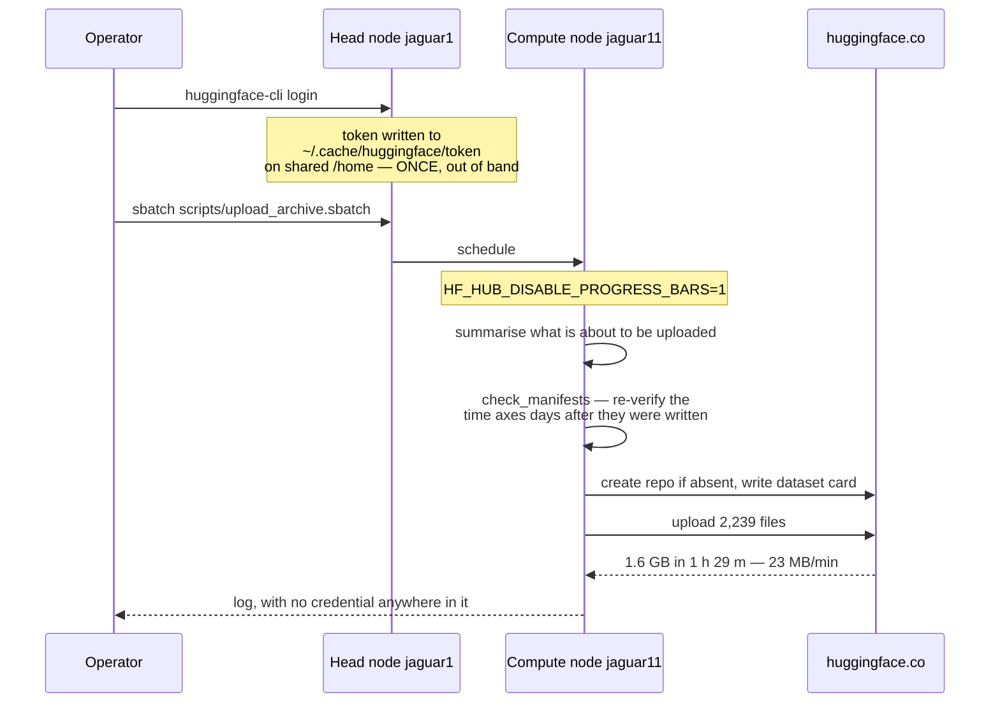
```mermaid
sequenceDiagram
    participant Op as Operator
    participant HN as Head node jaguar1
    participant CN as Compute node jaguar11
    participant HF as huggingface.co

    Op->>HN: huggingface-cli login
    Note over HN: token written to<br/>~/.cache/huggingface/token<br/>on shared /home — ONCE, out of band
    Op->>HN: sbatch scripts/upload_archive.sbatch
    HN->>CN: schedule
    Note over CN: HF_HUB_DISABLE_PROGRESS_BARS=1
    CN->>CN: summarise what is about to be uploaded
    CN->>CN: check_manifests — re-verify the<br/>time axes days after they were written
    CN->>HF: create repo if absent, write dataset card
    CN->>HF: upload 2,239 files
    HF-->>CN: 1.6 GB in 1 h 29 m — 23 MB/min
    CN-->>Op: log, with no credential anywhere in it
```

**There is deliberately no `--token` flag.** A token passed on a command line ends up in shell
history, in `ps` output, in CI logs, in `scontrol show job`, and in any transcript of the
session. The script reads whichever of `~/.cache/huggingface/token` or `$HF_TOKEN` is present
and never prints it. §14.

**`HF_HUB_DISABLE_PROGRESS_BARS=1`** for an operational reason worth knowing: tqdm keeps writing
its bar even to a non-tty, separated by **carriage returns rather than newlines**. In one job log
that made the whole progress display **one line, 25 kB of it** by the time the first phase was
13 % done — `grep -c` counts it as a single match, `tail` cannot trim it, and the output that
matters sits at the far end.

### 10.4 Site deployment


```mermaid
flowchart LR
    PUSH["push to main"] --> CI
    CI["GitHub Actions"] --> T1["npm ci"]
    T1 --> T2["npm test — 119 vitest tests"]
    T2 --> T3["VITE_BASE=/repo-name/ npm run build"]
    T3 --> ART["artifact: a few hundred kB<br/>+ lazy codec wasm"]
    ART --> DEPLOY["actions/deploy-pages"]
    DEPLOY --> SITE["user.github.io/MaritimeSAROptimisation/"]
    SITE -.->|"runtime HTTPS"| HFDATA["Hugging Face<br/>Zarr chunks"]

    style T2 stroke-width:2px
```

**The base path is the part that breaks silently.** A GitHub Pages *project* site is served from
`https://<user>.github.io/<repo>/`, not the domain root. Without a prefix every asset URL 404s
and the page renders **blank with nothing on it to say why**. It is set from `VITE_BASE` in the
workflow rather than hard-coded, so `npm run dev` and `npm run preview` keep working at `/`
locally.

**`npm test` runs before the build**, on the principle that the site is worthless if the field
maths is wrong and this is the last gate before it is public. And a passing test suite over a
site that does not build is not a green build, so the build step stays too — that is the step
that catches a broken import.

**The basemap key is a genuinely conditional dependency.** CARTO's raster basemaps now want a
key, and **without one they serve a watermarked tile rather than failing**. Since a CARTO map is
the default, a missing secret would have opened the deployed site watermarked — looking broken,
with nothing visible to explain it. So the CARTO layers are added **only when a key exists**, and
the default falls back to Esri Ocean. A fork, a checkout with no `.env.local`, and a deploy whose
secret was never set all then look deliberate.

The key ships in the built JavaScript — unavoidable for a client-side basemap — so **the
protection is a domain restriction set on CARTO's dashboard, not secrecy**. It is a repository
secret only to keep it out of the source tree.

---

## 11. Client architecture

### 11.1 The object model

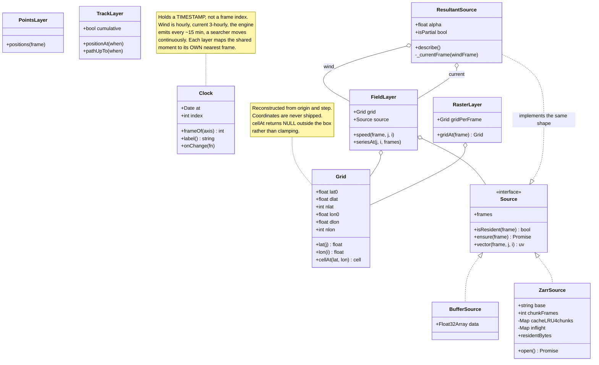
```mermaid
classDiagram
    class Clock {
        +Date at
        +int index
        +frameOf(axis) int
        +label() string
        +onChange(fn)
    }
    note for Clock "Holds a TIMESTAMP, not a frame index.<br/>Wind is hourly, current 3-hourly, the engine<br/>emits every ~15 min, a searcher moves<br/>continuously. Each layer maps the shared<br/>moment to its OWN nearest frame."

    class Grid {
        +float lat0
        +float dlat
        +int nlat
        +float lon0
        +float dlon
        +int nlon
        +lat(j) float
        +lon(i) float
        +cellAt(lat, lon) cell
    }
    note for Grid "Reconstructed from origin and step.<br/>Coordinates are never shipped.<br/>cellAt returns NULL outside the box<br/>rather than clamping."

    class Source {
        <<interface>>
        +frames
        +isResident(frame) bool
        +ensure(frame) Promise
        +vector(frame, j, i) uv
    }
    class BufferSource {
        +Float32Array data
    }
    class ZarrSource {
        +string base
        +int chunkFrames
        -Map cacheLRU4chunks
        -Map inflight
        +open() Promise
        +residentBytes
    }

    class FieldLayer {
        +Grid grid
        +Source source
        +speed(frame, j, i)
        +seriesAt(j, i, frames)
    }
    class RasterLayer {
        +Grid gridPerFrame
        +gridAt(frame) Grid
    }
    class PointsLayer {
        +positions(frame)
    }
    class TrackLayer {
        +bool cumulative
        +positionAt(when)
        +pathUpTo(when)
    }

    class ResultantSource {
        +float alpha
        +isPartial bool
        +describe()
        -_currentFrame(windFrame)
    }

    Source <|.. BufferSource
    Source <|.. ZarrSource
    FieldLayer o-- Source
    FieldLayer o-- Grid
    RasterLayer o-- Grid
    ResultantSource o-- FieldLayer : wind
    ResultantSource o-- FieldLayer : current
    ResultantSource ..|> Source : implements the same shape
```

**Four layer types, not "a wind layer".** `field`, `raster`, `points`, `track`. Only `field` has
real data today; the other three are built with their interfaces settled and their draw calls
stubbed, because **retrofitting them would be a rewrite: they differ in what they need from the
clock, not merely in how they look.** A `track` needs a position *interpolated between fixes*; a
`points` layer needs a whole cloud at once; a cumulative layer — the swept area behind a searcher
— needs everything from the start of the run up to now, not one frame.

**No renderer may assume the grid.** Each layer carries its own from the manifest, because the
probability map will arrive on a 200–500 m grid **inside a box that follows the drifting
ensemble** — nothing like the 0.25° wind grid — and search tracks carry no grid at all. That is
also why `RasterLayer` reads its grid **per frame** while `FieldLayer` reads it once.

**`buildLayer` throws on an unknown type rather than skipping it.** A layer that silently fails
to appear is the hardest kind of bug to notice on a map, because the map still looks perfectly
reasonable without it.

### 11.2 The source abstraction — and where the async seam is

A `FieldLayer` used to own one `Float32Array` covering the whole window. That is right for a 48 h
bundle and impossible for five years: the hourly wind tier alone is 1.32 GB. So the layer no
longer owns its data — **it owns a source**, and there are two, behind one interface.

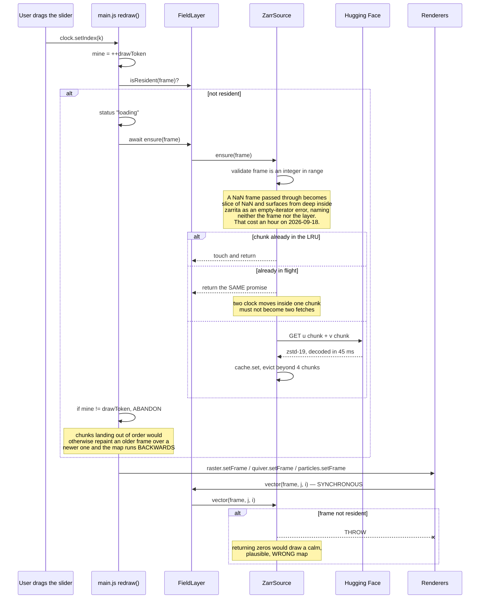
```mermaid
sequenceDiagram
    participant U as User drags the slider
    participant M as main.js redraw()
    participant L as FieldLayer
    participant S as ZarrSource
    participant HF as Hugging Face
    participant R as Renderers

    U->>M: clock.setIndex(k)
    M->>M: mine = ++drawToken
    M->>L: isResident(frame)?
    alt not resident
        M->>M: status "loading"
        M->>L: await ensure(frame)
        L->>S: ensure(frame)
        S->>S: validate frame is an integer in range
        Note over S: A NaN frame passed through becomes<br/>slice of NaN and surfaces from deep inside<br/>zarrita as an empty-iterator error, naming<br/>neither the frame nor the layer.<br/>That cost an hour on 2026-09-18.
        alt chunk already in the LRU
            S-->>L: touch and return
        else already in flight
            S-->>L: return the SAME promise
            Note over S: two clock moves inside one chunk<br/>must not become two fetches
        else
            S->>HF: GET u chunk + v chunk
            HF-->>S: zstd-19, decoded in 45 ms
            S->>S: cache.set, evict beyond 4 chunks
        end
        M->>M: if mine != drawToken, ABANDON
        Note over M: chunks landing out of order would<br/>otherwise repaint an older frame over a<br/>newer one and the map runs BACKWARDS
    end
    M->>R: raster.setFrame / quiver.setFrame / particles.setFrame
    R->>L: vector(frame, j, i) — SYNCHRONOUS
    L->>S: vector(frame, j, i)
    alt frame not resident
        S--xR: THROW
        Note over S: returning zeros would draw a calm,<br/>plausible, WRONG map
    end
```

**The async seam is `ensure()`, and it is deliberately narrow.** Reading a value stays
synchronous — `vector(frame, j, i)` — because the render loop, the renderers and the
click-a-point chart all want a number now, not a promise. What is asynchronous is making a frame
**resident**, and that happens **once per chunk boundary rather than once per read**. A caller
awaits `ensure(frame)` when the clock moves and then draws synchronously, which is why adding
five years of remote data did not change the shape of `main.js`.

Three properties that are each a bug prevented:

| Property | The bug it prevents |
|---|---|
| Non-resident read **throws** | a calm, plausible, wrong map |
| In-flight de-duplication | a fast slider drag across 192 frames issuing one fetch **per frame** instead of per chunk |
| `drawToken` generation counter | chunks landing out of order repainting an older frame over a newer one |
| LRU of 4 chunks (~8.9 MB) | unbounded memory on a long scrub |
| Manifest/store shape cross-check at `open()` | a manifest regenerated without its store, silently off-by-one on every index |

**Tier selection by visible span.** Nobody can perceive hourly detail while scrubbing across a
year, so nobody should download it: **1.32 GB hourly against 0.07 GB daily for the same five
years.** `pickTier` maps visible span to a tier (≤ 14 days → hourly, ≤ 120 → 6-hourly, else
daily) and, when the wanted tier is absent, **prefers the next coarser one** — that is the
direction that keeps the download bounded. This is not hypothetical: currents publish 3-hourly
and daily and **no hourly tier at all**, so a short span asks for `hourly` and the right answer
is 3-hourly, not daily.

### 11.3 Manifest-driven wiring

The manifest is the only thing that knows what exists, which is what lets a layer be added later
by writing its data and one manifest entry with **no change to `main.js`**.

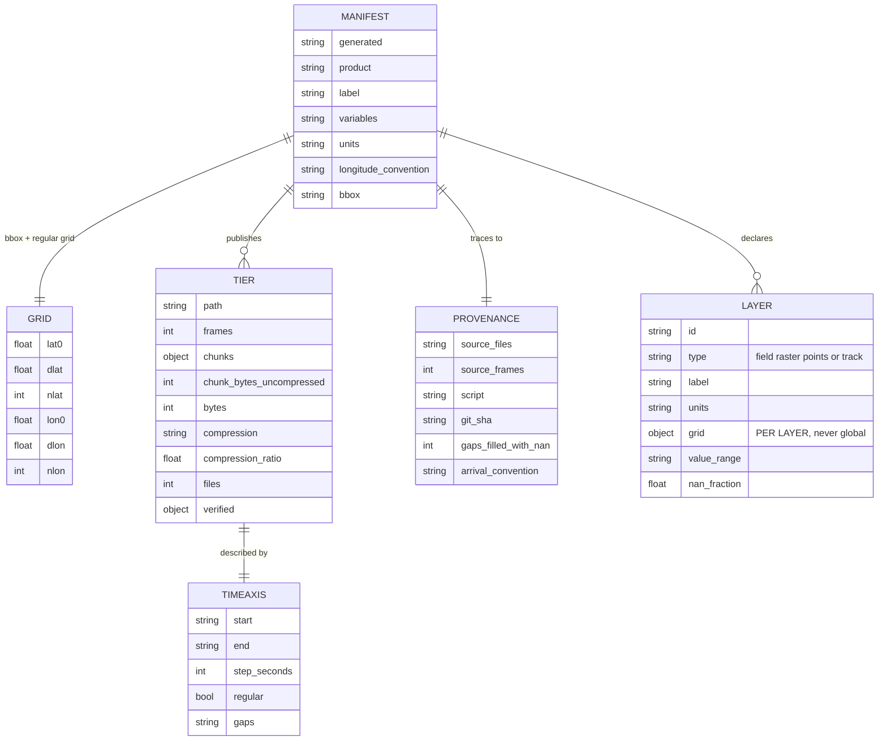
```mermaid
erDiagram
    MANIFEST ||--|| GRID : "bbox + regular grid"
    MANIFEST ||--o{ TIER : "publishes"
    MANIFEST ||--|| PROVENANCE : "traces to"
    MANIFEST ||--o{ LAYER : "declares"
    TIER ||--|| TIMEAXIS : "described by"

    MANIFEST {
        string generated
        string product
        string label
        string variables
        string units
        string longitude_convention
        string bbox
    }
    GRID {
        float lat0
        float dlat
        int nlat
        float lon0
        float dlon
        int nlon
    }
    TIER {
        string path
        int frames
        object chunks
        int chunk_bytes_uncompressed
        int bytes
        string compression
        float compression_ratio
        int files
        object verified
    }
    TIMEAXIS {
        string start
        string end
        int step_seconds
        bool regular
        string gaps
    }
    LAYER {
        string id
        string type "field raster points or track"
        string label
        string units
        object grid "PER LAYER, never global"
        string value_range
        float nan_fraction
    }
    PROVENANCE {
        string source_files
        int source_frames
        string script
        string git_sha
        int gaps_filled_with_nan
        string arrival_convention
    }
```

Two schema decisions to notice:

**`grid` belongs to the layer, not the manifest.** See §11.1 — the probability map will not share
the wind grid, and a renderer that assumed one grid would have to be rewritten.

**Coordinates are not shipped.** The grid is regular, so `lat0/dlat/nlat` is enough and the client
reconstructs. That saves **~47 KB per layer** and, more importantly, **removes any possibility of
the axes disagreeing with the data**. `grid_spec` raises on an irregular axis rather than letting
the client reconstruct wrong ones.

**`value_range` is carried** so the client can scale a colour ramp without reading the whole
buffer to find a maximum before it can draw anything.

### 11.4 Why the flat-bundle path still exists

`viz/export.py` writes one window as `manifest.json` + a raw little-endian float32 blob,
`[time][lat][lon][u,v]` interleaved.

**Why raw float32 and not JSON.** Measured: one hour of the 77 × 77 box is **46.3 KB** as
float32 and a 48 h window is **2.17 MB**, against roughly **4 MB of text** for the same numbers.
The browser turns the binary into an array in **one call** —
`new Float32Array(await res.arrayBuffer())` — instead of walking a JSON tree. **Half the bytes
and none of the parse.**

**Why interleave u and v.** One cell's two components are adjacent, so reading a vector is one
offset rather than two reads a whole plane apart.

It is kept alongside the Zarr path because it is still the right thing for **a single scenario
bundle** — which is exactly the shape the drift engine will emit per scenario — and for working
offline. The client tries the archive first and falls back to the bundle, and neither the layers
nor the renderers know which they got.

### 11.5 The resultant layer — showing the model, and saying what is missing

The map draws the wind. **The wind is not where anyone drifts.** `ResultantSource` composes the
forcing into the drift model's own left-hand side:

```
v_d = v_c(x,t) + α·v_w10(x,t) + η(t)
       ▲ term 1    ▲ term 2      ▲ term 3 — NOT DRAWABLE
```

**η is not a field.** It is a per-particle random draw at each timestep, so it has no value at a
location and cannot be drawn as an arrow at all. Showing `v_c + α·v_w10` and calling it "drift"
would quietly promise a determinism the model does not claim — **the whole reason the model is
stochastic is that two people in the same cell do not end up in the same place.**

So `describe()` returns the wording the UI must show and `isPartial` is true whenever a term is
missing, **so a caller cannot forget**. The same mechanism covered the interim state where the
current archive was not yet published: the layer ran with `current = null`, produced the leeway
term alone, and labelled itself *"Resultant drift (leeway only)"* with the caveat that the
current is usually the larger term in the Gulf Stream. Wiring the currents in is one argument;
no arithmetic, layer, renderer or legend changes.

**Which grid, and why the coarser one wins.** Output is on the **wind** grid. Wind is 0.25°
(77 × 77) and current is 0.08° × 0.04° (476 × 238), so one must be resampled, and **the coarser
is the honest choice**: interpolating wind up to the current grid would invent structure at 4 km
that a 28 km field does not contain. The current is sampled by **nearest neighbour** at each wind
cell centre — no averaging, so the value shown is one the archive really holds.

**Frame mapping is nearest, not most-recent.** Wind is hourly, current 3-hourly, so they do not
share an index. At 01:30 a 3-hourly field should snap forward to 03:00 rather than hold 00:00 for
another ninety minutes, which would make the current visibly lag the wind on the same map. The
clock uses the same rule.

**A NaN current cell is skipped, not added.** HYCOM's land mask is NaN; adding it would wipe out
the leeway term and blank the arrow, which reads as *"no wind"* rather than *"no sea"*.

### 11.6 Rendering, and one dependency that was removed

Three renderings of the same field, because they answer different questions and a good weather
map uses all three:

| Renderer | Answers |
|---|---|
| `raster.js` | **where** the field is strong — continuous, shows the shape |
| `particles.js` | **that** it is moving, and which way it turns |
| `quiver.js` | **what** the value is at a real cell centre |

**`leaflet-velocity` was adopted and then removed.** Two defects, both observed on 2026-09-18 and
neither reachable from outside the library: it indexes its grid with `floorMod(lon, 360)` against
raw map bounds, so **at low zoom it painted copies of our box across the Pacific**; and it
rebuilds on a **750 ms debounce**, so a pan **smeared the previous frame across the new
position**. The replacement is roughly 200 lines of canvas.

**Geodesy is never pixels.** Web Mercator stretches east–west with latitude; across the 17–36 N
box the same screen distance is **~18 % fewer kilometres at the top than the bottom**
(sec 36° / sec 17° = 1.18). The ruler uses `map.distance()`, the scale bar redraws on pan, and
the swept corridor must later be drawn geodesically or the helicopter's coverage silently shrinks
as it flies north. `geo.js` imports nothing — no Leaflet, no DOM — which is both why it is
testable and why the future KML export can reuse it.

**Measurement tools are first-class**, not decoration: a permanent scale bar, a ruler giving
distance, bearing and *"at 1.8 m/s that is N hours of drift"*, and range rings at 10/25/50/100 km.
Sweep width is ~185 m and probability cells will be 200–500 m; **without a ruler nobody can judge
whether a track spacing is plausible.**

The ruler and the rings are **mutually exclusive by construction**. Each registered its own map
click handler, so with both active a single click added a ruler point *and* moved the rings *and*
was then swallowed before the ruler's readout ran — three owners for one click. Turning either on
now turns the other off, which is also the honest interaction.

### 11.7 Two failure-visibility decisions

**A throw inside `start()` used to leave a map that rendered and a UI that did nothing**, with
the reason only in the console. The specific instance: `axis` was declared *below* the layer
control but referenced by the resultant layer — a temporal dead zone. The `ReferenceError` threw
out of `start()` and every wiring below that point (layer control, slider, play, ruler, rings,
click handler, provenance line) **silently never happened**. The map and its canvases still
rendered, because they are added above the throw. It looked like a working map with dead controls
rather than like a crash. Now anything that stops setup part way **says so on the page**.

**The status line names the fix.** With no data at all, the client prints the two commands that
would produce some.

---

## 12. Execution and orchestration

### 12.1 The Slurm topology

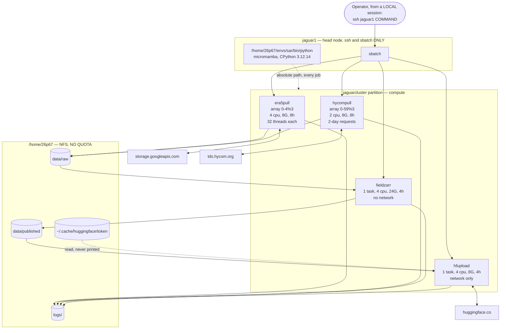
```mermaid
flowchart TB
    OP(["Operator, from a LOCAL session:<br/>ssh jaguar1 COMMAND"])

    subgraph head["jaguar1 — head node. ssh and sbatch ONLY"]
        SUB["sbatch"]
        MAMBA["/home/26p67/envs/sar/bin/python<br/>micromamba, CPython 3.12.14"]
    end

    subgraph nodes["jaguarcluster partition — compute"]
        J1["era5pull<br/>array 0-4%3<br/>4 cpu, 8G, 8h<br/>32 threads each"]
        J2["hycompull<br/>array 0-59%3<br/>2 cpu, 8G, 8h<br/>2-day requests"]
        J3["fieldzarr<br/>1 task, 4 cpu, 24G, 4h<br/>no network"]
        J4["hfupload<br/>1 task, 4 cpu, 8G, 4h<br/>network only"]
    end

    subgraph fs["/home/26p67 — NFS, NO QUOTA"]
        RAW[("data/raw")]
        PUB[("data/published")]
        LOGS[("logs/")]
        TOK[("~/.cache/huggingface/token")]
    end

    NET1["storage.googleapis.com"]
    NET2["tds.hycom.org"]
    NET3["huggingface.co"]

    OP --> SUB
    SUB --> J1 & J2 & J3 & J4
    J1 <--> NET1
    J2 <--> NET2
    J4 <--> NET3
    J1 --> RAW
    J2 --> RAW
    RAW --> J3 --> PUB
    PUB --> J4
    TOK -.->|"read, never printed"| J4
    J1 & J2 & J3 & J4 --> LOGS
    MAMBA -.->|"absolute path, every job"| nodes
```

**Everything is an array where it can be**, and not for throughput. *A failure costs one year, or
one month, not nine hours.* It is also the shape every later workload takes — one scenario per
task for the drift ensembles, one seed per task for PPO — so establishing it on a job we can
afford to get wrong is deliberate.

**`ssh jaguar1 '<cmd>'` is run from a local session**, never from a remote editor window,
because the decision vault lives on the local machine and the vault is the project's memory.

### 12.2 The shared-host rule

On 2026-09-15 an ARCO pull was run directly on `jaguar1`. It ran at **483 % CPU** and made the
login node unusable for the people whose login node it is — and, because of the task-graph bug
in §5.1, it did so at **zero bytes per second of network**.

`scripts/guard_shared_host.sh` now **refuses to start** heavy work on `jaguar1`/`jaguar2`,
exit 3, with instructions for what to do instead. `ALLOW_HEAD_NODE=1` overrides deliberately, and
even then it renices to 19, caps `SAR_FETCH_THREADS` from 32 to 8, and warns if the box is loaded.
The `THREADS` constant reads from the environment for exactly this reason.

**Shared head nodes run nothing but `ssh` and `sbatch`.**

### 12.3 The environment, which took four attempts

Each of these produced a failed job array before it was understood:

| Attempt | Failure |
|---|---|
| `source .venv/bin/activate` under `srun` | does **not** reliably take effect. Task 0 ran the system `/usr/lib/python3.8` and died on `import dask`, while the same `activate` works fine over ssh on the head node |
| `$REPO/.venv/bin/python` | **a venv does not contain an interpreter** — `bin/python` is a *symlink* to the system one, which is 3.12 on the head node and **3.8 on every compute node**. The same venv silently runs two different, incompatible Pythons depending on where the task lands. Three array attempts died on this before adding `python -V` made it visible |
| pip wheels into a venv on the compute nodes | the nodes are Ubuntu 20.04 with **glibc 2.31**, and modern pip wheels — cryptography's Rust extension in particular — require **2.33+** |
| **micromamba** at `/home/26p67/envs/sar` | **works.** It carries its own 31 MB interpreter and its packages come from conda-forge, built against **glibc 2.17** |

Two more lessons encoded in every sbatch file:

- **`PYTHONPATH="$REPO/src"`, not an editable install.** The editable install resolves on the
  head node and **not** on the compute nodes, even though `/home` is the same NFS export on both:
  `import sar` raises `ModuleNotFoundError` under `srun` while working fine under `ssh`. One line
  removes the dependency on pip's editable machinery across NFS entirely.
- **`SLURM_SUBMIT_DIR`, not `$(dirname "$0")`.** Slurm copies the script to
  `/var/spool/slurmd/job<N>/` and runs it from there, so `$0` points at the spool copy and the
  repository is nowhere near it.

### 12.4 Storage layout — four documented claims, all false

The cluster's storage layout was taken from an administrator's email and **all four claims
failed on contact with the machine**, measured 2026-09-14:

| Claimed | Measured |
|---|---|
| data goes in `/data1/26p67/` | `/data` and `/data1` are **empty, root-owned, unwritable mount points with nothing mounted on them** |
| `/home` has a quota | **no quota** — 2.5 GB written at 330 MB/s |
| Python 3.8 | **3.12.3** on the head node |
| — | `df -h` **cannot see any of this**: all three paths report the same `/dev/sda2` line, which reads like one big disk rather than two empty directories |

Everything lives under `/home/26p67/data/`. The `--out` flag has **no default** in
`sar.fetch.current` and is effectively mandatory in `sar.fetch.wind`, because a relative default
of `"data"` is how raw NetCDF ends up inside a synced cloud folder — which has already happened
once.

**The generalised rule: ask the machine, not the email.**

### 12.5 Dependency management

Pins live in **`pyproject.toml` and nowhere else**. There is deliberately **no
`requirements.txt`**: two files drift apart, and the pins must be identical on the laptop and the
cluster. Pins are recorded as *"the versions that produced that data"*, verified against a real
ARCO pull and a real GDP pull, not as a guess at what should work.

`huggingface_hub` is an **optional extra** (`.[publish]`), not a core dependency: the engine, the
fetchers and the hindcast validation never touch it, and the cluster should not have to carry an
HTTP client it needs only on the occasion the site is republished.

---

## 13. Verification and quality gates

Five independent layers, and they are independent on purpose — each catches a class the others
cannot see.


```mermaid
flowchart TB
    subgraph L1["1. Pre-flight — before any bulk pull"]
        CFP["scripts/check_forcing_pair.py<br/>ONE day of each field<br/>14 assertions against LIVE servers"]
    end
    subgraph L2["2. In-band guards — every run, in the code path"]
        G1["empty-axis asserts"]
        G2["all-NaN window check"]
        G3["land mask 2-40 percent"]
        G4["units must be m/s"]
        G5["depth must not survive as a dim"]
        G6["duplicate-timestamp assert"]
        G7["size estimate vs 3 GB threshold"]
        G8["irregular time axis refused"]
        G9["irregular lat/lon axis refused"]
    end
    subgraph L3["3. Round trips — the output re-read"]
        V1["verify_tier: a cell read back<br/>out of the written Zarr"]
        V2["export manifest arithmetic<br/>reproduces the source cell"]
        V3["zarrita in a browser matches<br/>Python to the last bit"]
    end
    subgraph L4["4. Cross-path reproduction"]
        X1["point lookup vs cluster archive:<br/>IDENTICAL BITS"]
        X2["data_io reproduces the fetcher's<br/>926,533 / 268 / 77.9 percent"]
        X3["viz.drifters reproduces it AGAIN<br/>and corrects 642 to 640"]
        X4["NaN gap count 7 matches the<br/>independent gap analysis"]
    end
    subgraph L5["5. CI — every push and PR"]
        C1["pytest -n auto — 198 tests"]
        C2["npm ci + vitest — 119 tests"]
        C3["npm run build"]
    end

    L1 --> L2 --> L3 --> L4 --> L5
```

### 13.1 The pre-flight is the highest-value test in the system

`scripts/check_forcing_pair.py` pulls **one day** of each field — 24 hourly wind steps, 8
three-hourly current steps, a few MB — and **asserts the pairing rather than printing it**. Exit
code 0 means the two fields can be handed to the same forcing provider.

Its docstring states the reason better than a summary can: *every failure mode here is silent.* A
longitude convention error, a flipped latitude axis, a cm/s-versus-m/s mix-up or a three-hour
time offset all produce a simulation that runs perfectly and **puts particles in the wrong
ocean**. Nothing crashes; the maps look plausible.

It checks window size (the end-exclusive off-by-one), D020 conventions on both, co-location,
time alignment, units, sign, the land mask, joint sampling at 20 arbitrary points, and that the
Gulf Stream core reads **0.8–3.0 m/s** — because a core reading ~180 instead of ~1.8 is a
factor-of-100 error that looks entirely plausible on a colour map. It also emits the jet
separation as a **number** (1.35° east of Cape Hatteras) rather than as a picture to eyeball,
and renders the deliverable quiver figure. **14/14 passing against the live servers.**

**What it deliberately does not do is regrid.** The fields are never merged onto a common grid
and do not have to be — the forcing provider samples each independently at the particle's own
`(x, y, t)`. **What must agree is the conventions, not the grids.**

### 13.2 Cross-path reproduction is the strongest evidence available

The same number arrived at by two code paths that share no code is worth more than any single
assertion:

- The live wind **point lookup** at 25.5 N, 70 W for 2021-01-05T12:00 returns
  `u10 = 6.110923767089844`, `v10 = 3.9555630683898926`, and the same cell read from the cluster
  **archive** returns the **identical bits**. That single test verifies the lookup, the 0–360
  conversion and the archive at once.
- `data_io.py` reproduces the fetcher's 926,533 observations / 268 buoys / 77.9 % undrogued from
  an independent path; `viz/drifters.py` reproduces it a third time **and corrects two figures in
  the decision record** (§5.3).
- The NaN gap count of **7** matches the independent missing-timestep analysis exactly.
- `zarrita` in a browser decodes a published chunk in **45 ms** returning values **byte-identical
  to Python** — which is what the whole codec decision rested on (§8.3).

### 13.3 CI, and why a green-looking pipeline is worse than none

Two jobs: Python (`pytest -n auto`) and frontend (`npm ci`, `npm test`, `npm run build`).

**CI had never passed since it was written**, and a merge is what exposed it. Three separate
bugs:

| Bug | Symptom |
|---|---|
| a stray character made `kname:` an invalid key | every run was titled `.github/workflows/tests.yml` rather than `Tests` — which is **exactly what GitHub does** when the `name:` key is invalid, and it was visible from day one |
| `python-version: "3.10"` | cannot install pins that require 3.11+ |
| npm cache keyed on a `package-lock.json` that did not exist | cache step failed |

**A pipeline that has never gone green is worse than none, because it reads as evidence.** The
`|| exit 5` tolerance for an empty suite was removed the day the suite became non-empty, so an
empty suite once again means something is wrong.

Test topology mirrors the source: `tests/{fetch,utils,viz,pipeline}/`. **198 Python tests, none
of which touch the network** — the fetchers are tested against synthetic datasets, which is
possible because the network call is one function at the edge of each module. **119 frontend
tests, none of which need a DOM** — see §3, rule 3.

---

## 14. Credentials and exposure

Three secrets exist, and each is protected by a different mechanism because each has a different
exposure surface.

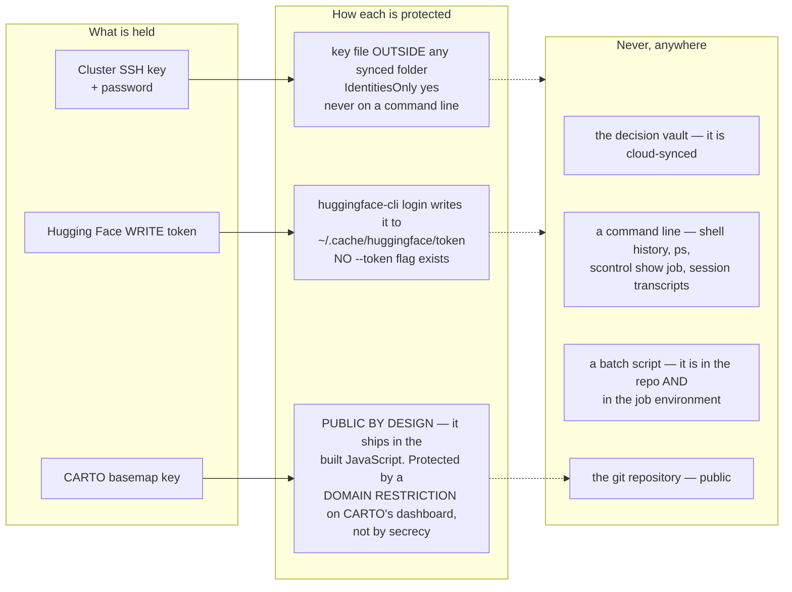
```mermaid
flowchart LR
    subgraph secrets["What is held"]
        S1["Cluster SSH key<br/>+ password"]
        S2["Hugging Face WRITE token"]
        S3["CARTO basemap key"]
    end

    subgraph protect["How each is protected"]
        P1["key file OUTSIDE any synced folder<br/>IdentitiesOnly yes<br/>never on a command line"]
        P2["huggingface-cli login writes it to<br/>~/.cache/huggingface/token<br/>NO --token flag exists"]
        P3["PUBLIC BY DESIGN — it ships in the<br/>built JavaScript. Protected by a<br/>DOMAIN RESTRICTION on CARTO's dashboard,<br/>not by secrecy"]
    end

    subgraph never["Never, anywhere"]
        N1["the decision vault — it is cloud-synced"]
        N2["a command line — shell history, ps,<br/>scontrol show job, session transcripts"]
        N3["a batch script — it is in the repo AND<br/>in the job environment"]
        N4["the git repository — public"]
    end

    S1 --> P1
    S2 --> P2
    S3 --> P3
    P1 -.-> never
    P2 -.-> never
    P3 -.-> N4
```

**The SSH configuration was itself a finding.** The `IdentityFile` pointed at a private key
sitting **inside a cloud-synced folder**, and `IdentitiesOnly yes` was not set — without it, SSH
offers every key it can find and **each rejection is a separate authentication failure** against
a four-strike, one-week IP ban.

**`scontrol show job` prints a job's environment to anyone on the cluster.** That is why the
upload job reads a token from a file on shared `/home` rather than receiving one.

**Two rotations are outstanding** and are tracked as project blockers rather than as todos: the
Hugging Face write token was pasted into a session transcript and must be revoked and reissued
(a write token can overwrite any dataset on the account), and the CARTO key's domain restriction
must be set before the site is public.

---

## 15. Failure catalogue

Every failure that changed the design. This table is the short form of the whole document, and
it is ordered by what it cost.

| # | Failure | Root cause | Design change |
|---|---|---|---|
| 1 | Wind fetch built a **1.3-million-task graph** and downloaded nothing; burned six cores for 30 min at 0 B/s | chunking at `open` time, over a padded 1,323,648-step axis | **select, then chunk.** `chunks=None` on open; `.chunk({"time":1})` after `.sel()` |
| 2 | `open_zarr` **never returned**, no error, past 30 minutes | store is Zarr **format 2** despite `.zarr-v3` in its path | `consolidated=True` |
| 3 | `KeyError: '10u'` | ARCO uses full CF names, not CDS/GRIB short codes | `VARS` map, measured against the store |
| 4 | Process **never exited** on the laptop; killed at 180 s on 0.03 s CPU | `atexit` handler joins a pooled worker that never returns | `hard_exit()` — and the measurement that it is **laptop-only**, so it does *not* explain the cluster's wall-clock kills |
| 5 | Six HYCOM array tasks died after **36 min each**, having written nothing | a half-year in one OPeNDAP request; **rate and maximum request size are independent limits** | `REQUEST_DAYS = 2`, monthly tasks, **resume by file-exists**, progress printed per piece |
| 6 | Current export **SIGKILLed twice** at 24 GB | `xr.concat` materialises before anything can chunk | **chunk each file before the concat** — 26.09 GB → 0.22 GB |
| 7 | Currents were about to be published at **half resolution**, discarding 75 % of cells | the binding constraint was assumed to be storage; it is **bytes per fetch** | per-product `TIME_CHUNK`; **full resolution**; limitation **L14 retired** |
| 8 | Two fetchers wrote **−70.0 and 290.0** for the same cell | no shared convention; each script self-consistent | **`geo.py`** — one normalisation point, one presentation boundary |
| 9 | Every year-boundary file **duplicated 1 January** | xarray reads a bare date as the whole day | explicit `time < end` in both fetchers; asserted in the pre-flight |
| 10 | A 264-frame archive would have labelled its last frame **51 days wrong**, rendering perfectly | client reconstructs `start + k·step`; the axis had a 1,225 h hole | `time_axis_spec` **refuses** an irregular axis before writing; client refuses `regular: false` |
| 11 | Three array attempts died on `import dask` / `ModuleNotFoundError` | a venv's `bin/python` is a **symlink** — 3.12 on the head node, 3.8 on compute; editable installs do not resolve over NFS under `srun` | **micromamba** at an absolute path, plus explicit `PYTHONPATH` |
| 12 | A fetch on the head node ran at **483 % CPU** and locked out its actual users | no guard | `guard_shared_host.sh`; `SAR_FETCH_THREADS` from the environment |
| 13 | Data written to `/data1/26p67/` — a path that does not exist | four claims from an email, none checked; `df -h` shows all three paths as one device | **ask the machine, not the email.** `--out` has no default |
| 14 | **CI had never passed** since it was written, and showed a run for every push | invalid `name:` key, wrong Python, cache keyed on a missing file | all three fixed; empty-suite tolerance removed |
| 15 | `leaflet-velocity` painted **copies of the box across the Pacific** and smeared frames on pan | `floorMod(lon, 360)` against raw bounds; 750 ms debounce | own canvas renderers; `worldCopyJump: false` |
| 16 | A map rendered with **every control dead** and nothing on the page to say why | temporal dead zone: `axis` referenced above its declaration, throwing out of `start()` | declaration moved; **a `start()` failure now prints to the page** |
| 17 | An hour lost to `"Input contains an empty iterator"` from deep inside zarrita, against an archive that was fine | a NaN frame index passed straight through to `slice(NaN, NaN)` | `ensure()` validates the frame and **names it and the store** |
| 18 | Deployed site would have appeared **watermarked** with no explanation | CARTO serves watermarked tiles for an unkeyed request rather than failing | CARTO layers added **only when a key exists**; Esri Ocean default |
| 19 | A GitHub Pages deploy would have rendered **blank with no error** | project sites are served from `/<repo>/`, not `/` | `VITE_BASE` in the workflow; dev still works at `/` |
| 20 | One job log became **a single 25 kB line** | tqdm separates updates with carriage returns even to a non-tty | `HF_HUB_DISABLE_PROGRESS_BARS=1` |
| 21 | `files[-1]` silently selected the **smallest** of three local CSVs | implicit source selection | refuses and lists them |
| 22 | Box-mean wind **understates** the wind that drives leeway by 2.4–3.8× | spatial averaging before analysis | measured (**limitation L13**): over 312 identical hours, box-mean peak **5.86 m/s** against per-cell **22.2 m/s**; **0 % of the box-mean record above 10 m/s against 16.7 % of cells** |

### The three patterns underneath

Reading the table, the same three shapes recur, and they are what a reviewer should take from
this system rather than any individual fix.

**1. The dangerous failures are the ones that render.** Wrong longitude, flipped latitude, a
three-hour offset, a mislabelled frame, a decimated grid, a watermarked basemap, a half-wired UI
— none of these crash. Every guard in §13 exists because the alternative is not an error, it is
a plausible picture. **The system's default assumption is that a silent wrong answer is the most
likely outcome of any change.**

**2. A measurement that is correct can still be useless.** The HYCOM throughput figure was
right and predicted nothing, because it measured the rate and not the maximum request. The
1.7-minute compression estimate was right and the publish took 13 minutes, because it measured
the codec and not the read. The 12.9 GB current estimate was right in memory and twice the size
on disk. **Every number now travels with what it was measured over.**

**3. Reasoning is not a substitute for a probe.** Two attempts at the memory failure went on
plausible stories about the sort, the `astype` and the write; ten lines of RSS printing answered
it in one run. Three attempts at the cluster environment went on theories about activation
scripts; `python -V` in the job script made it obvious. **The cheapest instrument beats the best
argument.**

---

## 16. The seams left for the engine and the agent

Nothing below is built. Everything below is a shape the existing code was designed to accept, so
that adding it is not a rewrite. This section exists so that whoever writes the engine can see
what has already been committed to on their behalf.

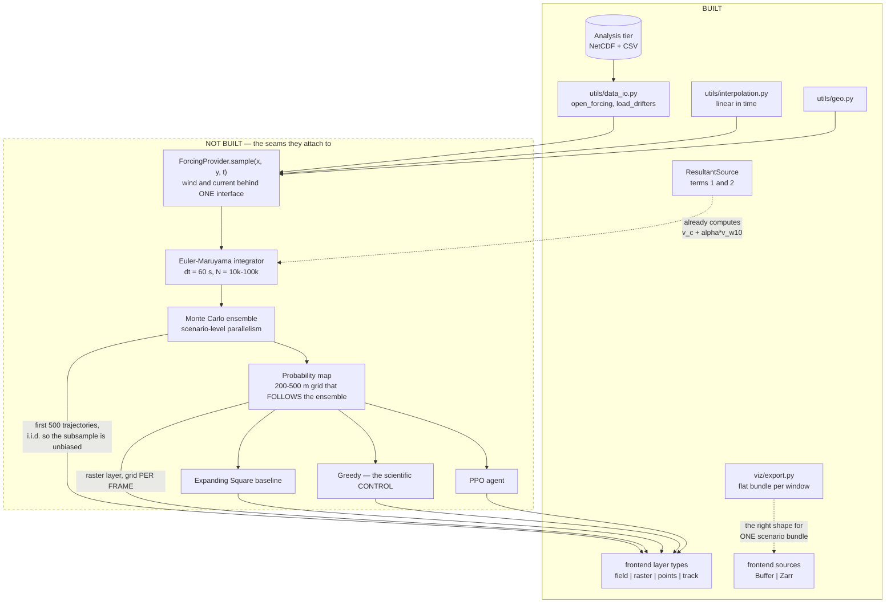
```mermaid
flowchart TB
    subgraph built["BUILT"]
        RAW[("Analysis tier<br/>NetCDF + CSV")]
        IO["utils/data_io.py<br/>open_forcing, load_drifters"]
        INT["utils/interpolation.py<br/>linear in time"]
        GEO["utils/geo.py"]
        EXP["viz/export.py<br/>flat bundle per window"]
        LAYERS["frontend layer types<br/>field | raster | points | track"]
        SRC["frontend sources<br/>Buffer | Zarr"]
        RES["ResultantSource<br/>terms 1 and 2"]
    end

    subgraph next["NOT BUILT — the seams they attach to"]
        FP["ForcingProvider.sample(x, y, t)<br/>wind and current behind ONE interface"]
        EM["Euler-Maruyama integrator<br/>dt = 60 s, N = 10k-100k"]
        MC["Monte Carlo ensemble<br/>scenario-level parallelism"]
        PM["Probability map<br/>200-500 m grid that FOLLOWS the ensemble"]
        ES["Expanding Square baseline"]
        GR["Greedy — the scientific CONTROL"]
        PPO["PPO agent"]
    end

    RAW --> IO --> FP
    INT --> FP
    GEO --> FP
    FP --> EM --> MC
    MC --> PM
    MC -->|"first 500 trajectories,<br/>i.i.d. so the subsample is unbiased"| LAYERS
    PM -->|"raster layer, grid PER FRAME"| LAYERS
    ES --> LAYERS
    GR --> LAYERS
    PPO --> LAYERS
    PM --> ES
    PM --> GR
    PM --> PPO
    EXP -.->|"the right shape for<br/>ONE scenario bundle"| SRC
    RES -.->|"already computes<br/>v_c + alpha*v_w10"| EM

    style next stroke-dasharray: 5 5
```

| Seam | Already committed to |
|---|---|
| `ForcingProvider.sample(x, y, t)` | `fetch_wind` and `fetch_current` have **deliberately identical signatures and identical return shapes**, so the provider does not special-case which field it holds. Both return the timestamp **actually selected** rather than the one requested, because current cannot promise the requested one |
| Time interpolation | `utils/interpolation.py` already generalises from a scalar to `(N, 2)` grid corners, for the bilinear case. Linear, matching what the frontend `TrackLayer` does, for the same reason: these are straight segments between known values |
| The probability map | `RasterLayer` reads its grid **per frame**, because the map's grid origin **moves with the ensemble**. `LAYER_TYPES` is declared in both the exporter and the client so the two cannot drift |
| Particle trajectories | `PointsLayer` expects `[time][particle][lat, lon]` for **~500 saved trajectories** — the first 500, chosen because they are i.i.d. and that makes the subsample unbiased. The remaining N are summarised by the probability map |
| Search tracks | `TrackLayer` carries `cumulative` and `swept_width_m`, because **the swept area accumulates** — it is what the RL reward is computed from, so showing it is showing the mechanism of the result |
| The clock | holds a timestamp, not an index, specifically so a ~15-minute engine emission and a continuously-moving searcher can share it with hourly wind and 3-hourly current |
| Beaching | beached particles are frozen and **keep their probability mass**, with `beached_mass` logged per timestep. Dropping the mass would make the map claim full confidence the target is at sea while a coastline had quietly absorbed half the distribution |
| Scenario bundles | `viz/export.py`'s flat float32 bundle is already the right shape and size for one scenario, which is why it was not deleted when the Zarr path landed |

**One open interface is deliberately still open.** The probability map's grid, resolution and
normalisation are a joint decision not yet frozen, and sweep width — which sets the cell size —
is unpinned. The client is built so that freezing them late costs a manifest entry rather than a
rewrite; that was the point of §11.1.

---

## 17. Provenance chain

The project's governing documentation rule is that **every number in the final report traces to a
file and a script**. This is how that is mechanically true rather than aspirational.

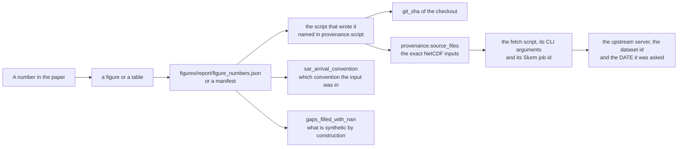
```mermaid
flowchart LR
    A["A number in the paper"] --> B["a figure or a table"]
    B --> C["figures/report/figure_numbers.json<br/>or a manifest"]
    C --> D["the script that wrote it<br/>named in provenance.script"]
    D --> E["git_sha of the checkout"]
    D --> F["provenance.source_files<br/>the exact NetCDF inputs"]
    F --> G["the fetch script, its CLI arguments<br/>and its Slurm job id"]
    G --> H["the upstream server, the dataset id<br/>and the DATE it was asked"]
    C --> I["sar_arrival_convention<br/>which convention the input was in"]
    C --> J["gaps_filled_with_nan<br/>what is synthetic by construction"]
```

Every manifest carries `provenance`: the script, the `git_sha` of the checkout that ran it, the
source filenames, the source frame count, the arrival convention and the count of NaN-filled
gaps. The frontend prints its own provenance line — tier, compression, size, frame count, build
date, commit — at the bottom of the map.

**`gaps_filled_with_nan` is the clearest example of why this matters.** It states, in the
published artefact itself, that some frames are absent by construction rather than by accident.
A reader who finds NaN in the store has an answer without having to ask anyone.

---

## Appendix A — measurement index

Everything in this document that is a measured number, with what it was measured over. Anything
not listed here is either derived arithmetic from these, or is flagged in the text as reasoning.

| Quantity | Value | Measured over |
|---|---|---|
| ERA5 box grid | 77 × 77 at 0.25° | the opened store |
| One wind hour, `u10`+`v10`, float32 | **46.3 KB** | computed from the grid |
| 48 h wind window | **2.17 MB** | a written bundle |
| Five years wind, hourly, float32 | **2.03 GB** | computed |
| ARCO chunk shape | `[1, 721, 1440]` — one global timestep | the store |
| ARCO fetch, serial | **0.72 s/chunk** → 26 h for 5 y | timed pull |
| ARCO fetch, 32 threads | **0.246 s/chunk** → 9 h for 5 y | timed pull |
| `open_zarr(chunks=None)` | **11.6 s**, 3 tasks | one open |
| `open_zarr(chunks={"time":1})` | **52.0 s**, 1,323,649 tasks | one open |
| ARCO padded axis | 1900-01-01 → 2050-12-31, 1,323,648 steps | the store |
| ARCO valid range | 1940-01-01 → **2026-05-31** final, 2026-09-04 ERA5T | store attributes |
| gcsfs exit, laptop | 14.0 s work, **killed at 180 s on 0.03 s CPU** | both machines, 2026-09-17 |
| gcsfs exit, cluster | **15.5 s wall, exit 0** | same |
| `ds.close()` as a fix | **still killed at 90 s** | same |
| HYCOM box grid | **476 lat × 238 lon**, 0.04° lat × 0.08° lon | the store |
| HYCOM per timestep | **885 KB** float32 in memory | computed from the grid |
| HYCOM per timestep, on disk | **443 KB** — int16, `scale_factor=0.001` | 112 MB for 247 steps, a real month |
| HYCOM half-year request | **500 SocketTimeout after ~36 min** | six failed array tasks |
| HYCOM 8-day request | **also times out** | one task |
| HYCOM 4-day request | **128 s** | one task |
| HYCOM throughput | **4.0 s/timestep** clean, **35 s** on a bad run | 4-day and 3-day requests |
| HYCOM readability scan | **0 unreadable** | 1,600 individual days |
| HYCOM missing steps | **7 in 14,608, 0.048 %** | the study window |
| HYCOM raw archive | **6.2 GB, 60 files, 0 failures** | the landing run |
| Land mask, one day | **11.8 % NaN** | 2021-01-05, written file |
| Gulf Stream separation | **1.35° east of Cape Hatteras** | pre-flight, as a number |
| GDP observations | **926,533**, 268 buoys | 2026-09-10, reproduced twice |
| GDP undrogued | **77.9 %** (77.8535 %) | same |
| GDP in-box segments | **825**, of which **640 ≥ 48 h duration** | same — corrects an earlier 642 |
| GDP raw / published | **108.8 MB CSV → 20.3 MB Parquet** | the publish run |
| GDP `sst` raw range | **−76.9 to 1000 °C** | the raw CSV |
| Codec: none / zstd-3 / -9 / **-19** / blosc | 9.11 / 7.20 / 6.58 / **5.78** / 7.11 MB | 9.11 MB of real float32 wind |
| zstd-19 write speed | **20 MB/s** | same |
| zarrita decode, one chunk | **45 ms**, byte-identical to Python | the live store |
| Wind Zarr, as built | **1,273.7 + 257.5 + 71.8 MB = 1.60 GB, 2,238 files** | Slurm 58640 |
| Wind publish, end to end | **13 min 02 s** | Slurm 58640 |
| Current Zarr, as built | **4.6 GB** — 4.1 GB + 524 MB, full resolution | Slurm 58726, 49 min |
| Current, projected vs actual | 9.9 GB projected, **4.6 GB actual** | ratios do not transfer |
| Per-fetch: wind 48-step | **1.11 MB** | computed and served |
| Per-fetch: current 48 / **8**-step | 29.0 MB / **4.8 MB** | computed |
| Coarse tiers compress worse | **29.5 → 36.1 → 39.7 KB/frame** | the three wind tiers |
| Peak RSS, concat | **0.22 → 26.09 GB → 0.22 GB fixed** | a 10-line probe, 60 files |
| Upload rate | **23 MB/min** — 1.6 GB, 2,239 files, 1 h 29 m | Slurm 58642 |
| Head-node fetch | **483 % CPU**, node unusable | 2026-09-15 |
| `/home` write | **330 MB/s**, no quota, 336 GB free | 2026-09-14 |
| Long text vs NetCDF, 2 days | **~160 MB vs ~11–14 MB** | written files |
| Web Mercator distortion, 17→36 N | **~18 %** (sec 36°/sec 17° = 1.18) | computed |
| Ruler check | Miami–Bermuda **1666 km** vs ~1670 published | one measurement |
| Box-mean vs per-cell wind | peak **5.86 vs 22.2 m/s**; **0 % vs 16.7 %** above 10 m/s | 312 identical hours |
| Tests | **198 Python, 119 frontend** | the suites |

## Appendix B — where everything lives

| | Path | Version control |
|---|---|---|
| Code | `github.com/Aditya-Raghunandan/MaritimeSAROptimisation` — **public** | git |
| Analysis tier | cluster `/home/26p67/data/raw/` | none — regenerable |
| Publication tier | cluster `/home/26p67/data/published/` | none — regenerable |
| Published data | `huggingface.co/datasets/AdityaRugs/MaritimeSARoperations` | HF revisions |
| The site | GitHub Pages, built from `frontend/` | git |
| Local data | `C:\maritime-data\{raw,derived}` | none — regenerable |
| Decision records | a separate, deliberately un-versioned vault | **none, and never** — a `.git` inside a cloud-synced folder corrupts itself |

### Companion documents in this repository

| | |
|---|---|
| [`docs/current-fetch.md`](current-fetch.md) | HYCOM retrieval and the OPeNDAP request-size ceiling in detail |
| [`docs/viz-export.md`](viz-export.md) | the published archive as a **schema reference** — this document is the architecture, that one is the format |
| [`docs/linear_time_interpolation.md`](linear_time_interpolation.md) | time interpolation and the `ForcingProvider` interface |
| [`docs/ADR001.md`](ADR001.md) | architecture decision record |
| [`docs/issue-template.md`](issue-template.md) | the Context / Scope / Acceptance criteria shape issues take here |

The numbered decision series (`D001`–`D021`), the limitations register (`L1`–`L15`) and the
dated notebook entries referenced throughout live in the project's decision vault, outside this
repository. Where this document cites a decision or a limitation by number, that is where the
options, the rejected alternatives and the evidence are recorded in full.
