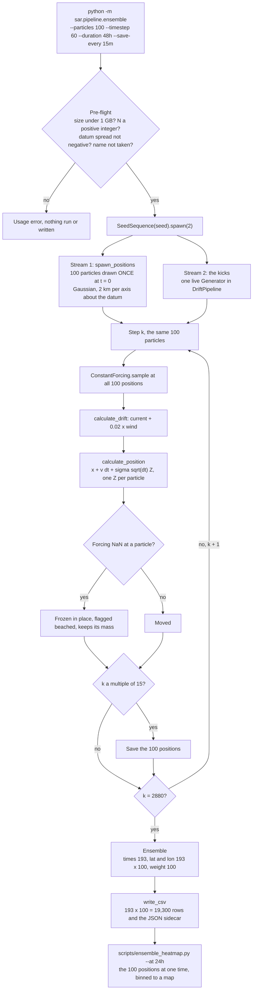

# The Monte Carlo ensemble (`sar.pipeline.ensemble`)

Closes #46 and implements R1e and R1f. One trajectory is one sample from a distribution; this module releases N particles from a perturbed datum, each with its own sequence of random kicks, and writes the cloud so it can be counted into the probability map the search is drawn from. It builds one `DriftPipeline` and consumes `track()`; the step, the forcing and the grid are the existing modules, unchanged.

## Running it

```
python -m sar.pipeline.ensemble \
    --lat 26.50 --lon -79.00 --datum-sigma-km 2.0 \
    --start 2019-06-01T06:00 \
    --timestep 60 --duration 48h \
    --particles 10000 \
    --sigma 0.1 --seed 20260923 \
    --constant-current 1.8 0.0 --constant-wind 5.0 0.0 \
    --save-every 15m \
    --out C:/maritime-data
```

Everything that defines what the run is has no default: `--lat`, `--lon`, `--datum-sigma-km`, `--start`, `--timestep`, `--duration`, `--particles`, `--constant-current` and `--out`. `--sigma` defaults to zero because it is unmeasured, as it does in `position.py` and `track.py`. `--seed` is optional; the entropy the run actually used is recorded in the sidecar either way. Spans take `48h`, `15m`, `90s` or a bare number of seconds.

On one core the command above takes 27 s and writes 1.93 million rows.

Before anything is run, the command checks the size of the file it would write, that N is a positive integer and the datum spread is not negative, and that no file of the same name already exists. Each failure is a usage error naming the problem, not a traceback. The last check matters for unseeded runs: two runs without `--seed` and with the same parameters share a name, and without it the second would silently replace the first. Pass `--seed` to keep both, or `--force` to replace.

## What one run does

The ensemble is released whole and never grows. With `--particles 100`, all 100 particles are placed at t = 0, scattered about the datum by `--datum-sigma-km`, and the same 100 are followed through every step to the end. No step adds, splits, clones or removes a particle, so N is 100 in every saved state and every row of the CSV belongs to one of those 100 tracks. A beached particle stays in the ensemble, frozen in place with its mass. `--save-every` thins the saved times, not the particles.

Growing the ensemble step by step was considered and rejected by D024: growing by cloning from one particle contained the truth 59 per cent of the time while claiming 90, because clones inherit their parent's early history, and shear stretches the earliest kicks the most. What survives of that proposal is the convergence ladder below, which runs each N as a separate full release instead.

For the command above with `--particles 100`:



The loop runs 2,880 times, 48 hours of 60 s steps, and at every pass it moves all 100 particles at once as one (100, 2) array. Particles never interact: each one's path is the path it would have taken alone, which `test_one_particle_is_unchanged_by_the_others` checks.

From Python:

```python
from sar.pipeline.ensemble import run_ensemble, describe_run, write_csv
from sar.pipeline.forcing import ConstantForcing

spec = dict(forcing=ConstantForcing((1.8, 0.0), (5.0, 0.0)), particles=10_000,
            start="2019-06-01T06:00", lat=26.5, lon=-79.0, duration=172800.0,
            timestep=60.0, datum_sigma_km=2.0, sigma=0.1, seed=20260923, save_every=900.0)
ensemble = run_ensemble(**spec)
path = write_csv(ensemble, describe_run(**spec), "C:/maritime-data")
```

`Ensemble` carries #46's fields unchanged: `times [T]`, `lat [T, N]`, `lon [T, N]`, `weight [N]` and `beached [T, N]`. The weights are uniform and sum to 1.

## The start cloud (R1e)

`spawn_positions(lat, lon, n, datum_sigma_km, rng)` draws each particle's east and north offset from a Gaussian of standard deviation `datum_sigma_km`, and converts metres to degrees through `calculate_position` itself, so the start cloud and every later step use the same sphere and the same $\cos\varphi$. At N = 10⁴ the cloud's standard deviation matches the value asked for to within 3 per cent on both axes.

The value of `datum_sigma_km` is not pinned anywhere in the vault. It is required so that no run can leave it unstated, but the number the paper uses needs its own decision file.

## What it writes

One CSV per run under `<out>/derived/`, long format, one row per particle per saved time:

```
step,seconds,time,particle,lat,lon,beached
```

Latitude and longitude are degrees, longitude in the store's 0 to 360 convention. `beached` is 0 or 1. `--with-forcing` adds `current_u`, `current_v`, `wind_u`, `wind_v`, `drift_u` and `drift_v`, empty on the final state, which has no step leaving it. `read_csv` reads a file back into an `Ensemble` with every position bit for bit what was written.

The run's parameters go in a `.json` sidecar beside it: the datum, N, the datum spread, the save interval, the seed and the entropy it resolved to, and `DriftPipeline.describe()` for the step, the leeway, sigma and the forcing.

### Naming

```
<out>/derived/ensemble_<datum>_<start>_N<particles>_dt<timestep>s_T<duration>_seed<seed>.csv
```

`<datum>` is the start position to two decimals with a hemisphere letter and no decimal point, `<start>` is `YYYYMMDDTHHMM`, `<duration>` is in the largest whole unit (`48h`, `90m`), and `<seed>` is the integer or `none`. The worked example:

```
ensemble_2650N07900W_20190601T0600_N10000_dt60s_T48h_seed20260923.csv
```

`parse_run_name` inverts `run_name`, so a file found on the cluster reads back into the parameters that produced it. The datum in the name is rounded; the sidecar holds it exactly.

### The size guard

At 60 s over 48 hours, 10⁴ particles saved every step is 28.8 million rows, an estimated 2.4 GB. Saved every 15 minutes it is 1.93 million rows and 162 MB, measured. `estimate_rows` works out the row count before anything is run and refuses anything over `MAX_BYTES`, 1 GB, unless `--force` is passed. The bytes per row are measured: 84 for the plain columns and 122 with forcing.

## Seeding

Every stream descends from one `np.random.SeedSequence`. `run_ensemble` spawns two children from it: one for the start cloud, one for the kicks. The convergence ladder spawns one child per rung and one grandchild per repeat, so no two runs share a stream.

Two things this is protecting against, both measured by the tests:

- **Seeding once and forking.** Two runs of N/2 given the same seed are the same N/2 particles twice. Their pooled map does not look wrong against a run of N, because a stream seeded once gives each half the first N/2 draws of the single run. What breaks is the sampling variance: over 200 repeats the pooled centroid of two forked halves scatters $\sqrt 2$ times as much as one run of N, the scatter of N/2 particles, while two spawned halves scatter like one run of N.
- **`spawn()` mutates the sequence it is called on.** Handing the same `SeedSequence` to two runs would give two different runs, because the second call spawns fresh children. `as_seed_sequence` rebuilds a copy from its entropy and spawn key first, so a run is a pure function of its seed.

`calculate_position` still accepts an integer `rng`, which reseeds identically on every call. That is correct for a single step and wrong inside a loop; `DriftPipeline` threads one live generator, and the parameter now says so.

## Beaching

Where the forcing at a particle is NaN, `DriftPipeline.advance` leaves the particle where it is and the ensemble flags it `beached`. It keeps its mass and a real position, which is what D016 and `normalise(counts, beached_mass=...)` require. No land mask is read here: with `ConstantForcing` the flag never fires, and detecting land is the beaching ticket's.

## From a CSV to a map

```
python scripts/ensemble_heatmap.py --csv <path> --at 24h --cell-m 500 --out figures/report/
```

`--at` is an offset from the start or an ISO instant, and must be a saved time. The script does no binning of its own: it runs `docs/probability-grid.md`'s four lines on the cloud at that one time (`from_envelope`, `bin`, `normalise`, `to_spec`) and renders through `sar.viz.fields`'s `_display_axes` and `_save`. It writes the PNG and a JSON beside it holding the grid spec, the `lost` count, the beached mass and the map's statistics:

**Table 1.** The statistics `ensemble_heatmap.py` reads off one map, and what each one measures.

| Statistic | What it is |
|---|---|
| `centroid_lat`, `centroid_lon` | the map's mean position, display longitude |
| `sd_north_km`, `sd_east_km` | the map's standard deviation along each axis |
| `spread_km` | the root mean square of the two, per axis, comparable to `datum_sigma_km` |
| `area90_km2` | the fewest cells holding 90 per cent of the mass, times the cell area |

On a synthetic cloud of known centre and spread the map recovers both to within one cell.

Two limits of these numbers. `lost` is reported because D016 requires it, but with `from_envelope` it is zero by construction, since the box is fitted to the very cloud being counted; it only carries information once a map is binned into a fixed box with `ProbabilityGrid.centred_on`, which is the episode's job. And the statistics are read off the binned map, not the particles, so each axis's variance carries an extra cell²/12: at 250 m cells on a 2 km cloud that is 1.3 m, well below anything else here.

## The convergence ladder (R1f)

```
python scripts/converge_ensemble.py --lat 26.5 --lon -79 --datum-sigma-km 2 \
    --start 2019-06-01T06:00 --timestep 60 --duration 48h --sigma 0.1 --seed 20260925 \
    --constant-current 1.8 0 --constant-wind 5 0 --cell-m 250 \
    --rungs 100 1000 10000 100000 1000000 --repeats 5 --out figures/report/
```

Each rung is `--repeats` separate full runs at that N, each reduced through `ensemble_heatmap.reduce_cloud` at the end of the run. The error at a rung is the scatter of each statistic across its repeats, which should fall as $1/\sqrt N$, a slope of $-\tfrac12$ on the log-log figure. It writes `ensemble_convergence.png` and the statistics as JSON.

### What it found, 2026-09-25

An indicative ladder, not the production one: D024's tolerance is not set yet, and nothing should run the production ladder until it is. The command above ran with `--rungs 100 1000 10000 100000` and 5 repeats, stopping at 10⁵ because the 10⁶ rung costs about 504 s a run. It took 3 minutes 52 seconds on one core. The forcing is uniform, so the true cloud at 48 h is a round Gaussian of 2.0004 km per axis, with a true 90 per cent area of $\pi s^2 \cdot 2\ln 10$ = 57.9 km².

**Table 2.** The indicative convergence ladder over 48 h, five repeats per rung, 250 m cells. Scatter is the standard deviation across the repeats; the last column is the mean 90 % area as a share of the true 57.9 km².

| N | Centroid scatter (km) | Spread, mean (km) | Spread scatter (km) | 90 % area, mean (km²) | Of the true area |
|---|---|---|---|---|---|
| 10² | 0.236 | 1.954 | 0.058 | 5.3 | 9 % |
| 10³ | 0.125 | 1.997 | 0.042 | 31.6 | 55 % |
| 10⁴ | 0.046 | 2.004 | 0.007 | 53.5 | 92 % |
| 10⁵ | 0.006 | 2.002 | 0.004 | 57.5 | 99 % |

The centroid's scatter falls with a fitted slope of $-0.52$ and the spread's with $-0.43$, both close to $-\tfrac12$ over four rungs of five repeats each. The 90 per cent area does not behave like either: it is biased low rather than noisy, because at small N each particle occupies a cell of its own and the count of cells holding 90 per cent of the mass measures the number of particles rather than the distribution. Its scatter across repeats is small at every rung, so repeating seeds cannot detect the bias; only the mean against N shows it, which is why the figure plots the area's mean in its own panel rather than as a slope. This agrees with `scripts/toy_convergence.py`, which found the same bias on a synthetic cloud.

What this says about N, pending D024's tolerance: the centroid is settled to 50 m by 10⁴, and the spread to 10 m, but the 90 per cent area R2c validates against needs 10⁵ at 250 m cells before it is within 1 per cent of the truth for a 2 km cloud. The N the area needs scales with the cloud's area over the cell's area, so a cloud that currents have sheared wider will need more particles than this one, not fewer.

## The ensemble spread at arrival

ADR002's outstanding table records the ensemble spread at the searcher's arrival as 2 km, never measured, and the grid's 250 to 500 m cell window rests on it.

Measured on the run in **Running it** (10⁴ particles, 2 km datum spread, $\sigma$ = 0.1, 1.8 m/s current, 5 m/s wind) through `ensemble_heatmap.py` at 250 m cells:

**Table 3.** The ensemble's spread per axis at four times after the datum, under uniform forcing.

| Time after the datum | Spread per axis |
|---|---|
| 0 h | 1.999 km |
| 6 h | 1.999 km |
| 24 h | 1.999 km |
| 48 h | 1.999 km |

**The spread at arrival is 2.0 km, and it is the datum spread that was put in.** Under uniform forcing every particle drifts identically, so nothing but the datum and the kicks spreads the cloud, and the kicks add $\sigma\sqrt t$ in quadrature: 42 m at 48 h, which is $\sqrt{2000^2 + 42^2}$ = 2000.4 m. The ADR002 figure is therefore confirmed only in the sense that a 2 km datum stays a 2 km cloud when the current has no shear. The number that decides the cell window is the spread once real currents shear the cloud apart, which needs the gridded forcing backend, and it depends on the datum spread whose value R1e has not yet pinned. Until both exist, ADR002's row should read "2 km under uniform forcing, by construction; the sheared spread is unmeasured".

## Not here, and deliberately

- **Measuring sigma** against the GDP drifters, which depends on the sealed drifter set (#51).
- **`src/sar/model/probmap.py`**, the published map product and its time series (ADR002).
- **Beaching detection** from a land mask, and the GSHHG cross-check D016 requires.
- **The gridded forcing backend** reading HYCOM and ERA5 through `sar.model.interpolate`. This command gains a flag for it then.
- **Per-particle sampled properties**, such as alpha drawn across R1c's range.
